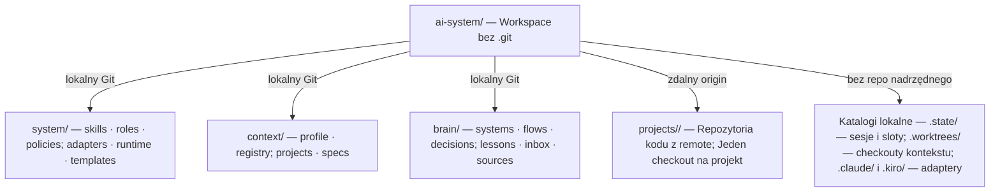
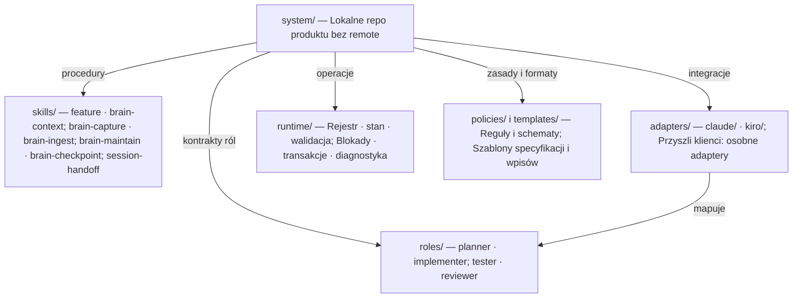
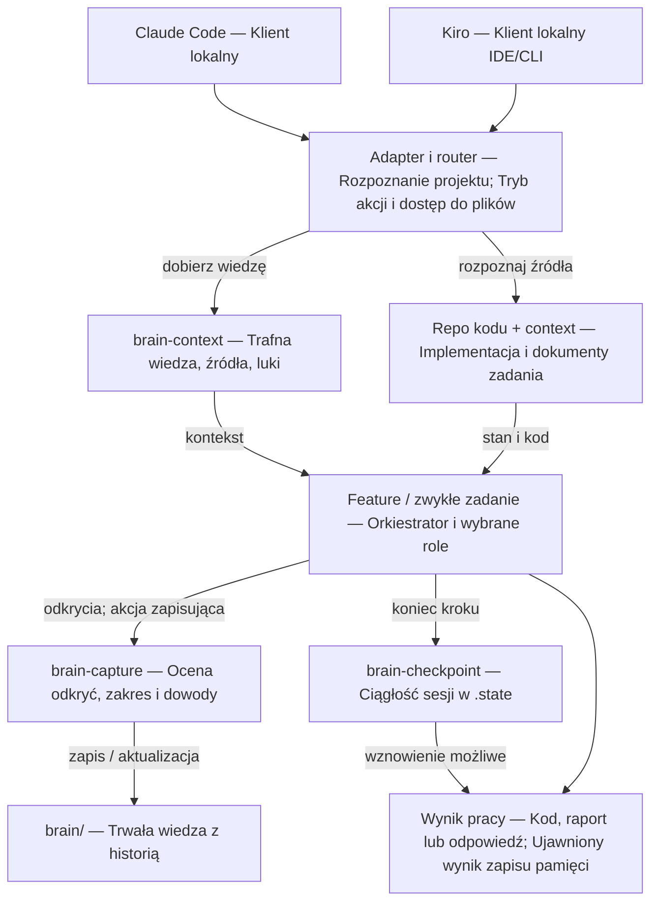
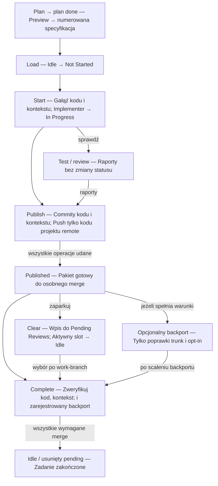
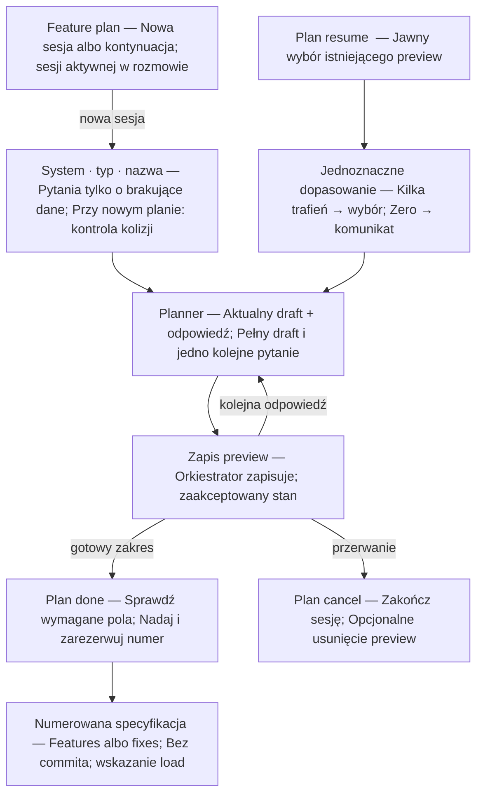
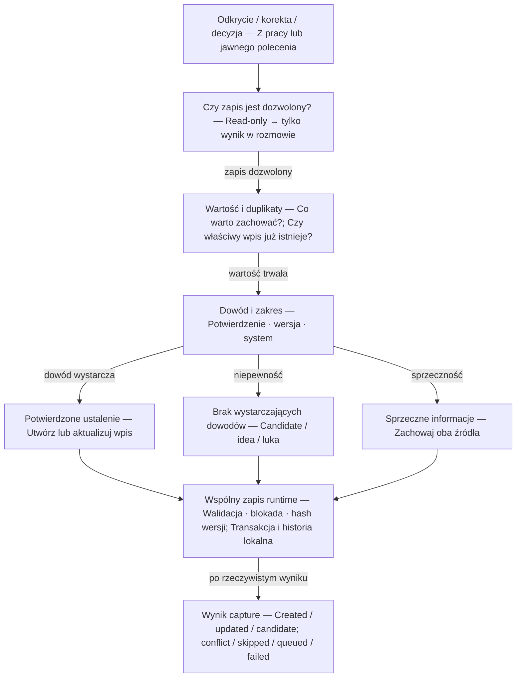
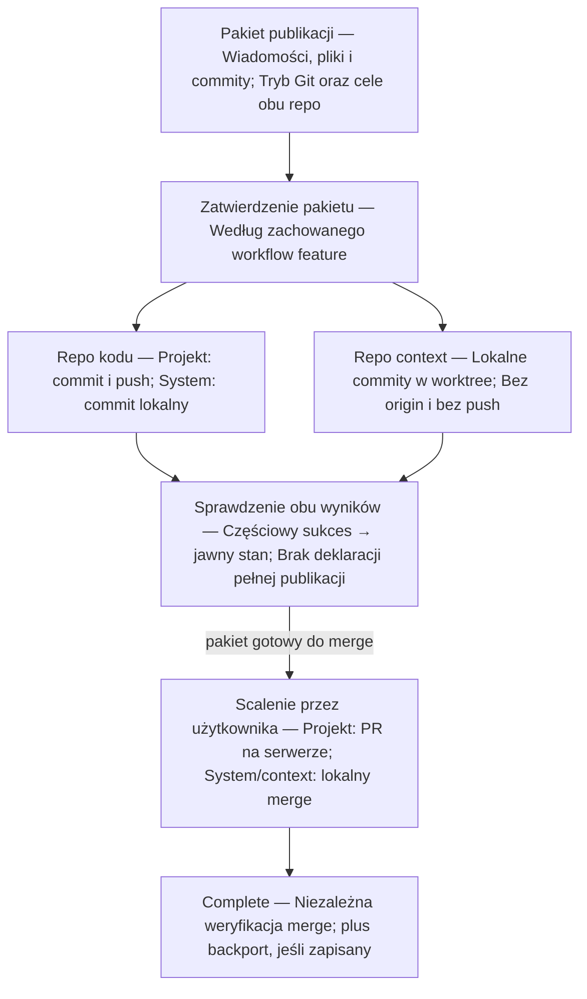
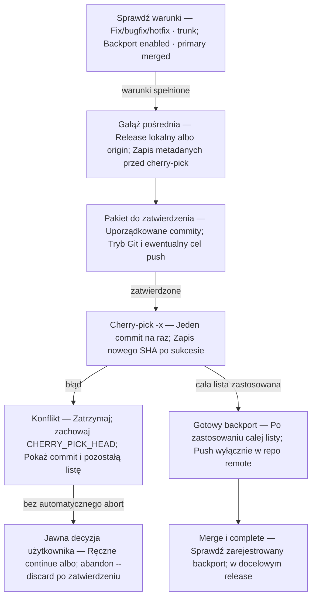
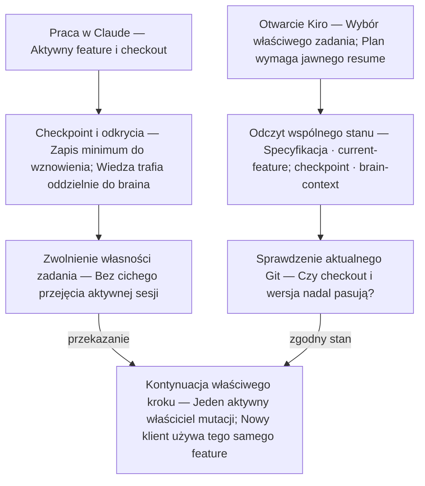
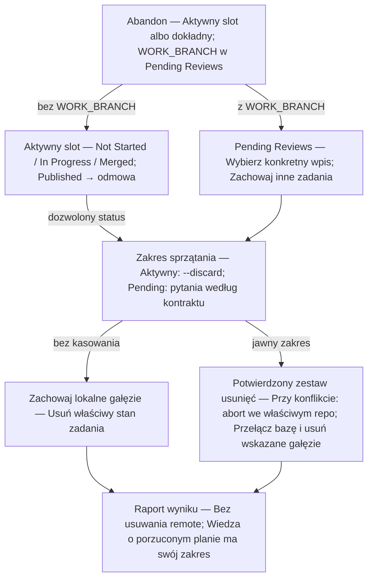

# ai-system — pełna dokumentacja produktu

**Projekt do akceptacji · wersja 4 · 18 września 2026**

Własne środowisko pracy z agentami: folder nadrzędny bez Git, niezależne repozytoria projektów, wspólna wiedza i zachowany workflow feature. Claude Code i Kiro korzystają z tego samego stanu; kolejne narzędzia dołączają przez adapter.

Agent ma rozpoznawać wartościowe ustalenia podczas pracy, sprawdzać istniejącą wiedzę, sam ją zapisywać lub uzupełniać oraz krótko informować o wyniku. Każdy zapis ma źródło i zakres. Odróżniamy ustalenie, propozycję, roboczą implementację i wdrożenie.

Dokument obejmuje cały projekt produktu, dokładne kontrakty skilli, modele danych i błędów, 10 diagramów oraz pełne oryginalne źródła operacyjne feature. To dokumentacja do zatwierdzenia, **nie gotowa implementacja ani plan kolejnych prac**. Kroki budowy opracujemy po akceptacji.

Wersja 4 uwzględnia ustalenie: **zdalne repozytoria mają wyłącznie projekty**. System/context/brain używają lokalnego Git bez origin. Zaktualizowano diagramy, opis bootstrapu oraz kontrakty start/publish/complete/backport. Nowy rozdział VI opisuje dokładną adaptację; oryginalne źródła pozostały bez zmian.

## Jak czytać ten dokument

| Część | Zawartość |
|---|---|
| I. Architektura | Cel, foldery, granice Git, vault, klienci i codzienna praca |
| II. Diagramy | Katalogi, pełny przepływ, feature, plan, pamięć, publish, backport, przekazanie i abandon |
| III. Skille | Cel, wyzwalacze, wejścia, odczyt/zapis, procedura, błędy i przykłady |
| IV. Kontrakty | Komendy feature, stany, role, dane, awarie i odbiór produktu |
| V. Przykłady | Rejestr projektów, notatka, obserwacja i granice automatyzacji |
| VI. Lokalny Git | Repo systemowe bez remote i wymagane zmiany feature |
| VII. Źródła | Pełny feature, role, handoff i zasady w wersji źródłowej |

**Do czytania bez repo:** HTML ma osadzone diagramy i źródła; Markdown zachowuje edytowalną treść. ZIP zawiera także wybrany snapshot 77 oryginalnych plików ai-os i wejściowy plan second brain. Źródła są przypięte do commita `1e2cb5a9de87f58ec15ccb412d545347a30075b2`; ich zgodność bajtowa została sprawdzona. Nie jest to kopia aplikacji przykładowych ani całej historii Git.

## I. Architektura produktu

Projekt nowego systemu pisanego od podstaw, z zachowaniem zachowania obecnego skilla `feature` i dodaniem wspólnej pamięci. Głównymi klientami są Claude Code i Kiro. Kolejny klient ma korzystać z tego samego systemu przez adapter.

To wersja do dyskusji i akceptacji architektury. Nie jest backlogiem, harmonogramem ani instrukcją instalacji. Nie utworzono implementacji ani nie zmieniono repozytorium GitHub. Rozpisanie kroków budowy nastąpi po zatwierdzeniu projektu.

### 1. Podstawa projektu: co rzeczywiście jest w ai-os

Przeczytano źródła na `main`, commit `1e2cb5a9de87f58ec15ccb412d545347a30075b2`: README, CLAUDE.md, GUIDELINES, wszystkie akcje skilla feature, cztery role feature, session-handoff, konfigurację i wybrane dokumenty wyjaśniające wcześniejsze decyzje.

Aktualny system ma:

- Nadrzędne repo ai-os obejmujące skille, kontekst i wiki; projekty mogą być częścią tego repo albo osobnymi repozytoriami.
- Centralny router CLAUDE.md i kontekst projektów poza ich kodem.
- Skill `feature` zarządzający całym cyklem pracy, jednym aktywnym zadaniem per system oraz Pending Reviews.
- Cztery role: planner, implementer, tester i reviewer. Stan workflow i operacje Git należą do orkiestratora.
- Dwie gałęzie dla projektu z własnym repo: kodu oraz kontekstu w repo ai-os.
- Osobne planowanie wielu preview, jawne wznawianie i numerowane specyfikacje.
- Kontrolę publikacji, konfigurację Jira, backport poprawek oraz tryb z lokalnym bare origin dla dotychczasowego repo ai-os.
- Wiki traktowane jako ostatnie miejsce wyszukiwania; procedury feature są samowystarczalne.
- `session-handoff`, który wyświetla blok do skopiowania i z założenia nie zapisuje pliku.

Dokument `0014-local-install-update.md` opisuje plan instalatora, ale w odczytanym drzewie nie ma katalogów `scripts/` ani `assets/` przewidzianych przez ten dokument. Sama obecność specyfikacji nie oznacza gotowej implementacji.

Źródła odniesienia:

- [README](https://github.com/michalgodziszewski/ai-os/blob/1e2cb5a9de87f58ec15ccb412d545347a30075b2/README.md)
- [Feature: akcje](https://github.com/michalgodziszewski/ai-os/blob/1e2cb5a9de87f58ec15ccb412d545347a30075b2/.claude/skills/feature/SKILL.md)
- [Rozpoznawanie systemów i dwie gałęzie](https://github.com/michalgodziszewski/ai-os/blob/1e2cb5a9de87f58ec15ccb412d545347a30075b2/.claude/skills/feature/actions/_common.md)

Obecne ai-os jest wzorcem zachowania. Nowy system otrzyma własne źródła i układ; nie zakładamy przebudowy istniejącego repo w miejscu ani kopiowania całej jego historii.

### 2. Docelowa struktura

Folder nadrzędny `ai-system/` nie ma repozytorium Git. W środku znajdują się niezależne repozytoria i lokalny stan pracy.

| Ścieżka względem ai-system | Przeznaczenie | Wersjonowanie |
|---|---|---|
| `system/` | Kod i instrukcje nowego systemu AI | Lokalny Git, bez remote |
| `context/` | Konfiguracja instalacji i projektów, specyfikacje workflow | Lokalny Git, bez remote |
| `brain/` | Jeden globalny vault wiedzy | Lokalny Git, bez remote |
| `projects/<name>/` | Kod konkretnego projektu | Osobne repo każdego projektu ze zdalnym origin |
| `.state/` | Aktywne sloty, preview, checkpointy, blokady, kolejka awarii | Bez Git; dane trwałe wymagają backupu |
| `.worktrees/` | Izolowane checkouty gałęzi kontekstu | Worktree repo context; katalog nadrzędny bez repo |
| `AGENTS.md`, `CLAUDE.md` | Generowane krótkie wejścia do systemu | Odtwarzalne z system |
| `.claude/`, `.kiro/` | Konfiguracja dla otwarcia całego workspace’u | Generowana, bez ręcznie utrzymywanych kopii logiki |

Ustalenie z 18 września 2026: zdalne repozytoria mają wyłącznie projekty. Repozytoria system, context i brain używają lokalnego Git bez remote, także bez lokalnego bare origin. Zachowują commity, gałęzie i historię, ale nie wykonują fetch/pull/push. Rejestr opisuje tryb każdego repo: local-only albo remote. Brak origin w system/context/brain jest prawidłową konfiguracją; brak skonfigurowanego origin w projekcie jest błędem konfiguracji. Pełną adaptację akcji określa rozdział o lokalnym Git.

Rozdzielenie `context` i `brain` jest celowe: publikacja specyfikacji zadania podlega workflow feature, natomiast przechwytywanie wiedzy ma działać na bieżąco. Te operacje nie powinny wzajemnie blokować swoich gałęzi ani przypadkowo publikować tych samych plików.

### 3. Pięć pojęć, których nie mieszamy

| Pojęcie | Odpowiada na pytanie | Przykład |
|---|---|---|
| Workspace | Gdzie działa cała instalacja? | ai-system |
| Cel pracy feature | Który projekt ma aktywny slot i workflow? | projects/lfo-gui |
| Repozytorium | Gdzie są kod, gałęzie i commity? | repo lfo-gui |
| System biznesowy/techniczny | O jakim elemencie architektury wiemy? | frontend, API, worker, baza |
| Sesja agenta | Kto i w jakim kliencie teraz pracuje? | sesja Claude albo Kiro |

Termin `--system` w feature pozostaje zgodny z obecnym interfejsem: oznacza cel workflow. System wiedzy w brainie jest osobną encją. Nie wymuszamy relacji 1:1: jeden projekt może obejmować kilka usług; jedna baza może być używana przez kilka projektów.

Stały rejestr w `context/registry/` mapuje cele workflow, repozytoria, systemy wiedzy i względne ścieżki. Lokalne nadpisania, np. checkout poza workspace’em, są w `.state/`. Rozpoznanie uwzględnia tożsamość repo i worktree, a nie tylko nazwę folderu.

Dla kompatybilności `--system ai-os` wskazuje nowy `system/`. Nadrzędne `ai-system/` nigdy nie staje się celem operacji Git. Domyślne zachowanie poszczególnych akcji opisano w kontrakcie feature poniżej.

### 4. System: miejsce, które będziesz dostosowywał

| Obszar w system | Co zawiera |
|---|---|
| `skills/feature/` | Jeden wspólny skill i jego akcje |
| `skills/brain-context/` | Procedura wyszukiwania wiedzy |
| `skills/brain-capture/` | Procedura zapisu i aktualizacji |
| `skills/brain-ingest/` | Kontrolowane wprowadzanie systemu lub źródła |
| `skills/brain-maintain/` | Przegląd jakości i aktualności |
| `skills/brain-checkpoint/` | Minimalny stan do wznowienia sesji |
| `skills/session-handoff/` | Dotychczasowe podsumowanie do skopiowania |
| `roles/` | Wspólne kontrakty planner/implementer/tester/reviewer |
| `policies/` | Zasady pracy i pamięci niezależne od klienta |
| `templates/` | Szablony specyfikacji, notatek i konfiguracji |
| `adapters/claude/`, `adapters/kiro/` | Specyficzne konfiguracje, hooki, mapowanie narzędzi i modeli |
| `runtime/` | Mały lokalny program: stan, pliki, rejestr, walidacja i zapis |
| `docs/` | Dokumentacja samego systemu |

Skille i role są plikami, które możesz zmieniać w swoim repo. Proponowany runtime to mały CLI w TypeScript, dopasowany do Twojego doświadczenia. Nie wymaga serwera NestJS, bazy wektorowej ani stale działającego procesu.

Rozdział odpowiedzialności:

- **Skill** określa, jak przeprowadzić zadanie i jakie informacje zebrać.
- **Rola** określa odpowiedzialność agenta, zakres pracy i format odpowiedzi.
- **Runtime** wykonuje deterministyczne czynności, np. walidację, bezpieczny zapis i przejście stanu.
- **Adapter** tłumaczy te pojęcia na możliwości klienta.

Rozumienie reguły biznesowej należy do modelu i człowieka. Poprawność formatu i ochronę przed nadpisaniem nowszego pliku można sprawdzać programowo.

Preferencje użytkownika i ustawienia konkretnego projektu należą do `context`, nie do ogólnej treści skilla. Konfigurację klienta generujemy ze źródeł; ręczne edytowanie kopii instalowanych w dwóch narzędziach prowadziłoby do rozjazdów.

### 5. Context: konfiguracja i dokumenty pracy

| Obszar | Zawartość |
|---|---|
| `context/profile/` | Preferencje komunikacji i pracy użytkownika |
| `context/registry/` | Rejestr projektów, repozytoriów i mapowania do systemów wiedzy |
| `context/ai-os/` | Kontekst rozwoju samego systemu AI |
| `context/projects/<name>/project-overview.md` | Przeznaczenie projektu, stack, struktura, komendy |
| `context/projects/<name>/coding-standards.md` | Standardy kodowania tego projektu |
| `context/projects/<name>/project-config.md` | Jira, backport, repo, bazy gałęzi i polityka publikacji |
| `context/<context_path>/features/`, `fixes/` | Zatwierdzone specyfikacje; context_path z rejestru, np. projects/customer-ui albo ai-os |

Projekt-overview jest jednym autorytatywnym dokumentem orientacyjnym. Brain może do niego odsyłać, ale nie utrzymuje drugiej niezależnej kopii listy komend i stacku. Instrukcje znajdujące się już w repo projektu pozostają źródłami zasad tego projektu; osobisty kontekst nie powinien ich po cichu zastępować.

Krótkotrwały stan runtime jest oddzielony od dokumentów wersjonowanych. `current-feature.md` zachowuje dotychczasowe pola i Pending Reviews, ale jest lokalnym plikiem w `.state/features/<system>/`. Preview planów znajdują się w `.state/plans/<system>/`. Te zmiany lokalizacji są jawną zmianą infrastruktury, nie zmianą znaczenia komend.

`plan done` nadal nadaje numer i kończy planowanie bez commita. Sfinalizowana specyfikacja czeka w lokalnym stagingu dokumentów do `start`. Po utworzeniu gałęzi kontekstu jest przenoszona do jej worktree. Resolver aktualizuje ścieżkę Source Spec; istnieje jeden aktywny egzemplarz dokumentu danej rewizji. Brain odwołuje się do stabilnego identyfikatora zadania, a nie tymczasowej ścieżki worktree.

Numeracja skanuje specyfikacje scalone, oczekujące i aktywne worktree danego systemu. Rezerwacja numeru jest blokowana na czas operacji, żeby dwie sesje nie nadały tego samego numeru. Wiele planów może współistnieć; jedno aktywne zadanie per system pozostaje regułą.

### 6. Kontrakt feature — co zachowujemy

Źródłem zgodności są konkretne akcje istniejącego skilla, nie jedynie skrót w SKILL.md. Przykładowo tabela ogólna mówi o domyślnym ai-os, ale aktualne `plan.md` wymaga pytania o system przy nowym planie bez argumentu; `status` bez argumentu obejmuje wszystkie systemy.

| Akcja | Zachowanie do zachowania |
|---|---|
| `plan` | Nowy preview albo kontynuacja planowania śledzonego w tej rozmowie; pytania pojedynczo; brak zgadywania istniejącego planu |
| `plan resume <name>` | Jawny wybór preview; przy kilku trafieniach wybór systemu |
| `plan status` | Braki aktywnego planu albo lista wszystkich preview; bez zapisu |
| `plan cancel` | Koniec bieżącego planowania; usunięcie pliku wyłącznie na żądanie/potwierdzenie |
| `plan done` | Wymagane pola, numeracja, feature/chore → features, fix/bugfix/hotfix → fixes, bez commita |
| `load` | Jedno aktywne zadanie per system, Source Spec, status Not Started, dotychczasowe reguły tworzenia brakującego kontekstu |
| `start` | Sprawdzenie repo i jawnych baz; fetch/ff-only tylko projektu ze zdalnym origin; lokalna baza dla system/context; gałęzie, checklisty i implementer |
| `test` | Rzeczywiste komendy projektu i wyniki per check; bez zmiany stanu workflow i bez napraw kodu |
| `review` | Ocena zmiany względem Goals/Constraints/Acceptance Criteria; odczyt, bez poprawiania kodu |
| `publish` | Konkretny pakiet commitów do zatwierdzenia; lokalne commity system/context, push wyłącznie gałęzi projektu ze zdalnym origin |
| `clear` | Przeniesienie Published/Merged do Pending Reviews i zwolnienie slotu; bez potwierdzania merge |
| `complete` | Sprawdzenie wszystkich wymaganych merge, w tym kontekstu i zarejestrowanego backportu; potem zwolnienie/usunięcie wpisu |
| `abandon` | Dotychczasowe rozróżnienie aktywnego slotu i konkretnego Pending Reviews; usuwanie gałęzi jawne, bez usuwania remote |
| `backport` | Tylko opt-in projektu i poprawki trunk; osobna gałąź z istniejącego release, uporządkowane cherry-pick -x, stan aktualizowany po każdym commicie |
| `status` | Widok aktywnych zadań, Pending Reviews i preview; bez argumentu wszystkie systemy; bez zapisu |

Zachowujemy też:

- Stały szablon specyfikacji: Git Workflow, Description, Goals, Constraints, References, Acceptance Criteria.
- Nazewnictwo gałęzi i commitów oraz opcjonalny Jira Ticket. Jira pozostaje polem wpływającym na nazwy, nie integracją API.
- Bazy kodu i kontekstu są jawne w specyfikacji. W nowym planie agent pyta o brakującą bazę, po jednym pytaniu; podanej już wartości nie pyta ponownie. Oryginalne main jako fallback pozostaje opisem starego skilla, nie sposobem uzupełniania nowych planów.
- Jednego właściciela mutacji stanu feature: orkiestrator. Role nie robią commitów, pushów ani zmian current-feature.
- Dotychczasowy model zatwierdzania publikacji, ręcznego merge i osobnego zatwierdzania destrukcyjnego sprzątania. Nowa pamięć nie rozszerza tych uprawnień.
- `test`, `review`, `status` i `plan status` pozostają działaniami bez zapisu do pamięci oraz stanu. Hook nie wykonuje ukrytego capture po tych akcjach. Odkrycia z ich odpowiedzi można wykorzystać przy kolejnym kroku zapisującym albo osobnym wywołaniu brain-capture.
- Brak automatycznego uruchamiania kolejnych akcji feature tylko dlatego, że poprzednia się skończyła. Obecna sekwencja sterowana poleceniami pozostaje.
- Session-handoff zachowuje wyjście w rozmowie; checkpoint plikowy jest osobnym mechanizmem.

#### Granice zgodności, które trzeba nazwać

Zachowujemy interfejs, role i cykl feature, z jawną adaptacją zachowania Git do repo bez remote. Nowy układ wymaga zmiany rozpoznawania katalogów i repo. Każdy projekt ma własne repo, więc odpada dotychczasowy wariant projektu śledzonego w nadrzędnym ai-os. Dwie gałęzie dla kodu i kontekstu pozostają. W nowym układzie także rozwój `system/` korzysta z oddzielnej gałęzi kontekstu — wcześniej ai-os miał obie rzeczy w jednym repo. Obie gałęzie pozostają wtedy lokalne. Dawny tryb Remote: local oznaczał bare origin; nowy local-only oznacza całkowity brak remote i wymaga zmiany komend, a nie wyłącznie komunikatów.

Sprawdzanie merge w starym skillu opiera się na ancestry oryginalnych SHA. Zachowanie tego kontraktu oznacza obsługę scalania zachowującego te commity; squash/rebase wymagałby osobnej, jawnej zmiany. Obecny backport przechowuje tylko ostatni zestaw metadanych backportu. Nie zmieniamy go po cichu na zarządzanie wieloma release’ami naraz.

Szczegóły wymagające usunięcia sprzeczności źródeł zapisujemy jawnie: start faktycznie ustawia In Progress w końcowym kroku, choć komentarz w backport opisuje to inaczej. Warunek czystego repo powinien rozpoznawać oczekiwane, własne dokumenty planu; lokalny staging daje temu jednoznaczne miejsce. Nie traktujemy takich rozbieżności dokumentacji jako dodatkowych funkcji.

### 7. Dwie gałęzie bez nadrzędnego repo

Dla zadania w projekcie powstają:

- Gałąź kodu w `projects/<name>/`.
- Gałąź kontekstu w repo `context/`, zawierająca dokumenty tego zadania.

Gałąź kontekstu ma własny worktree w `.worktrees/context/<work-item-id>/`. Dwa projekty nie przełączają sobie wspólnego checkoutu context i nie przenoszą przypadkowo niezacommitowanych dokumentów między gałęziami. Nazwy i cele gałęzi pozostają zgodne z kontraktem feature; ścieżka worktree jest detalem wykonania.

`publish` przedstawia wspólny pakiet operacji na dwóch gałęziach. Dla projektu: commit i push kodu oraz lokalny commit kontekstu. Dla rozwoju systemu: dwa lokalne zestawy commitów, bez push. Częściowy sukces musi być widoczny. Po osobnym, kontrolowanym przez użytkownika scaleniu `complete` sprawdza kod projektu względem świeżo pobranej bazy origin, kod systemu względem lokalnej bazy, a kontekst zawsze względem lokalnej bazy repo context. Backport dotyczy wyłącznie kodu.

Wiedza w `brain/` nie jest trzecią gałęzią tego feature’a. To niezależny zapis z przypisanym zakresem: plan, konkretna gałąź, commit albo środowisko. W ten sposób pamięć może powstawać podczas pracy, nie udając stanu już wdrożonego.

### 8. Brain — jeden globalny vault

Brain jest zwykłym folderem Markdown, który można otworzyć w Obsidianie. Działanie agentów nie wymaga uruchomienia Obsidiana ani konkretnej jego wtyczki.

| Folder | Wiedza |
|---|---|
| `systems/<system-id>/` | Zachowania, integracje i pułapki danego systemu |
| `domains/` | Słownik i reguły biznesowe |
| `flows/` | Przepływy przez kilka systemów |
| `data/` | Znaczenie struktur danych i zależności |
| `decisions/` | Podjęte decyzje wraz z uzasadnieniem |
| `runbooks/` | Sprawdzone procedury |
| `lessons/` | Przyczyny problemów i rozwiązania warte ponownego użycia |
| `ideas/` | Propozycje, nieudające podjętych decyzji |
| `inbox/` | Niepewne ustalenia, brakujące informacje i konflikty |
| `sources/` | Niezmienne, oczyszczone snapshoty materiałów źródłowych |
| `_index.md`, `_generated/` | Odtwarzalne indeksy i raporty |

Relacje są opisane identyfikatorami w metadanych i linkami w treści. Nie potrzeba osobnej bazy grafowej, żeby powiązać frontend, API, bazę i regułę biznesową. Zależność calls zapisujemy raz; zależności odwrotne generujemy.

Nie zapisujemy całych rozmów ani każdej przeczytanej funkcji. Wartość wpisu wynika z przydatności przy przyszłym pytaniu: dlaczego coś działa w dany sposób, co wpływa na inne systemy, czego nie wolno przeoczyć, jak wcześniej rozwiązaliśmy problem.

### 9. Polityka zapisu: autonomicznie, z zakresem i źródłem

Domyślna propozycja: agent może sam zapisywać wartościowe fakty i jawnie podjęte decyzje. Informuje krótko o wyniku, bez osobnego „zapisać?” za każdym razem. To świadoma zmiana względem starej filozofii ręcznego zatwierdzania każdego trwałego wpisu, wynikająca z obecnego wymagania użytkownika.

| Informacja | Działanie |
|---|---|
| Sprawdzone zachowanie kodu | Zapis z dowodem i rewizją |
| Wyraźna decyzja użytkownika | Zapis decyzji, uzasadnienia i zakresu; bez ponownego pytania o samo dokumentowanie |
| Potwierdzona przyczyna błędu i rozwiązanie | Lessons/runbook z warunkami zastosowania |
| Wniosek bez wystarczających dowodów | Candidate w inbox, z opisem braków |
| Pomysł agenta | Idea/proposal |
| Nowe źródło sprzeczne z notatką | Konflikt i obie referencje; bez cichego wyboru |
| Nowsze jednoznaczne ustalenie w tym samym zakresie | Aktualizacja istniejącego wpisu z historią |
| Istniejący duplikat | Uzupełnienie źródeł lub brak nowego zapisu |
| Sekret, token, pełny connection string | Pominięcie; przechowujemy tylko nazwę połączenia/zmiennej |

Każda notatka ma co najmniej: stabilne ID, typ, temat, powiązane systemy, status, zakres, dowód i datę weryfikacji. Dowód może być ścieżką i symbolem kodu wraz z commitem/hashem, referencją do dokumentu albo krótkim zapisem jawnego ustalenia użytkownika z datą i identyfikatorem sesji.

Rozróżniamy:

- **Status treści:** candidate, confirmed, disputed, superseded.
- **Aktualność:** checked albo needs-review.
- **Zakres:** planowana zmiana, working tree, commit/gałąź, środowisko.

Potwierdzony fakt z feature brancha może być prawdziwy na tej gałęzi i nie dotyczyć produkcji. Merge nie jest dowodem deploymentu. Zmiana pliku źródłowego oznacza potrzebę przeglądu powiązanej wiedzy, nie automatyczne unieważnienie całego braina.

Nie można samą datą nadawać pewności. Weryfikacja ma wskazywać konkretny dowód. Ręcznie chronione notatki dostają propozycję aktualizacji zamiast nadpisania. Aktualizacja wiedzy nie zmienia automatycznie uprawnień, skilli ani polityk wykonawczych.

Proponowane profile zapisu do późniejszej konfiguracji: `automatic` jako domyślny, `inbox-only` i `manual`. Zmiana profilu jest decyzją użytkownika, nie swobodnym wyborem agenta. Tryb tylko do odczytu pojedynczej akcji zawsze wyłącza zapis, niezależnie od profilu.

### 10. Skille pamięci i ich granice

| Skill | Wejście i efekt | Czego nie robi |
|---|---|---|
| `brain-context` | Cel, systemy i rewizje → trafne notatki, źródła, luki i ostrzeżenia o aktualności | Nie zapisuje wiedzy; nie wczytuje całego vaulta |
| `brain-capture` | Odkrycie lub zbiór ustaleń → zapis, aktualizacja, kandydat, konflikt albo świadome pominięcie | Nie zmienia stanu feature ani zasad agentów |
| `brain-ingest` | Wskazane repo lub materiał → uporządkowana wiedza w wybranym zakresie | Nie skanuje automatycznie wszystkich repo i sekretów |
| `brain-maintain` | Wybrany zakres braina → przegląd linków, źródeł, duplikatów, kandydatów i świeżości | Nie uznaje treści za prawdziwą tylko dlatego, że plik jest poprawnym Markdown |
| `brain-checkpoint` | Bieżąca sesja → mały zapis pozwalający wznowić pracę | Nie przepisuje całej rozmowy i nie zastępuje current-feature |

Capture obejmuje zarówno nowe notatki, jak i aktualizacje. Nie tworzymy osobnego skilla dla każdej drobnej operacji na pliku. Ingest służy pierwszemu poznaniu źródła, maintain utrzymaniu istniejącej wiedzy, a capture codziennej pracy.

Checkpoint przechowuje: session-id, klienta, cel workflow, identyfikator zadania/planu, aktualny krok, referencje do plików, otwarte pytania i nieprzetworzone odkrycia. Stan Git i status feature odczytuje ponownie ze źródeł, zamiast ufać staremu opisowi checkpointu.

Użytkownik nadal może ręcznie powiedzieć „zapisz to”, „co wiemy o scoringu?”, „zaktualizuj wiedzę o tym API” albo „przejrzyj brain”. Skille mają także działać w zwykłej rozmowie o projekcie, poza cyklem feature.

### 11. Automatyczne zauważanie wiedzy podczas pracy

Agent uruchamia ocenę potrzeby zapisu, gdy:

- Użytkownik poprawił jego rozumienie systemu lub doprecyzował regułę biznesową.
- W celu rozwiązania problemu trzeba było zbadać kilka repozytoriów.
- Odkryto nieoczywisty efekt uboczny lub zależność.
- Zidentyfikowano i sprawdzono przyczynę błędu.
- Podjęto decyzję, której uzasadnienie może być ważne później.
- Powraca pytanie, na które baza nie daje odpowiedzi.
- Znaleziono sprzeczność między notatką a bieżącym źródłem.

Przed zapisem sprawdza wartość dla przyszłej pracy, istniejące wpisy i dowody. Nie mówi „nie ma tego w całej bazie”, jeśli jedynie nie znalazł odpowiedzi w ograniczonym wyszukiwaniu. Wskazuje sprawdzony zakres.

Przykładowe zachowanie:

> Warto to zachować: ta zależność wpływa na frontend i API, a nie znalazłem jej w opisie przepływu. Uzupełniłem notatkę i dodałem źródła.

> Zapisuję Twoje ustalenie jako planowaną zmianę. W obecnym kodzie ta reguła jeszcze nie obowiązuje.

> Znalazłem sprzeczność w opisie statusu. Zachowałem oba źródła. Trzeba ją rozstrzygnąć przed zmianą tego fragmentu.

Komunikaty grupujemy na końcu naturalnego kroku, żeby nie przerywać co chwilę pracy. Istotne odkrycie trafia na dysk w trakcie zadania. Nie polegamy wyłącznie na końcowym hooku.

### 12. Połączenie feature i brain

Feature otrzymuje jawne punkty integracji. Procedury feature pozostają samowystarczalne; brain dostarcza wiedzy o domenie i projektach, a nie instrukcji wyjaśniającej, jak wykonać Git workflow.

| Moment | Odczyt/zapis pamięci |
|---|---|
| Rozpoczęcie planowania | Brain-context: istotne reguły, wcześniejsze decyzje i luki |
| Kolejna odpowiedź w planowaniu | Aktualizacja preview; capture tylko trwałych, wyraźnie podjętych ustaleń, z oznaczeniem planned |
| Plan done | Powiązanie ustaleń z numerowaną specyfikacją; brak oznaczania implementacji jako wykonanej |
| Load/start | Odczyt aktualnego kontekstu i źródeł; powiązanie sesji z zadaniem i checkoutem |
| Istotne odkrycie w implementacji | Natychmiastowy zapis małej obserwacji i następnie ocena capture |
| Zakończenie kroku implementacji | Checkpoint i uzupełnienie wiedzy; wynik brain oddzielony od statusu feature |
| Test/review/status | Odczyt; brak dodatkowych zapisów. Raport może wskazać odkrycia warte osobnego capture |
| Publish | Finalizacja oczekujących odkryć przed przygotowaniem publikacji; wiedza nadal ma zakres gałęzi, a branch brain nie wchodzi do pakietu publish |
| Complete | Aktualizacja zakresu na potwierdzony merge dla konkretnych faktów; brak automatycznego stwierdzenia deploymentu |
| Abandon/plan cancel | Faktycznie poznane zachowania pozostają; niezrealizowane propozycje są oznaczane jako porzucone, a nie wdrożone |

Zachowujemy szablon specyfikacji. Odnośniki do wiedzy trafiają do istniejącej sekcji References, istotne ograniczenia do Constraints, a wymagane sprawdzenia do Goals/Acceptance Criteria. Luki i pełny pakiet kontekstu sesji mogą pozostać w checkpoincie. Nie dokładamy obowiązkowo kilku nowych sekcji do każdego feature’a.

Read-only akcje nie zapisują również dziennika wiedzy w hooku. Samo wyszukiwanie może działać bez trwałej telemetrii. Dzięki temu „status” nadal oznacza tylko sprawdzenie stanu.

Jeżeli brain jest niedostępny, agent ujawnia brak pamięci i korzysta z bieżącego kodu, jeśli zadanie nadal da się wykonać poprawnie. Odkrycia zapisuje do lokalnej kolejki awarii i oznacza jako oczekujące. Nie twierdzi, że zapis do braina się udał. Jeżeli brak konkretnej wiedzy uniemożliwia poprawną decyzję, zatrzymuje ten krok i wyjaśnia, czego brakuje.

### 13. Role i wspólny orkiestrator

| Rola | Zachowana odpowiedzialność | Dodatek związany z pamięcią |
|---|---|---|
| Planner | Pełny zaktualizowany draft i jedno kolejne pytanie; bez zapisu plików | Otrzymuje kontekst brain i wskazuje luki |
| Implementer | Realizacja Goals w wyznaczonym repo; bez commit/push i bez stanu feature | Raportuje odkrycia wraz ze źródłami |
| Tester | Uruchamia realne sprawdzenia i raportuje wyniki; bez napraw kodu | Oznacza potwierdzone zachowania przydatne w przyszłości |
| Reviewer | Ocenia diff i nowe pliki względem specyfikacji; bez edycji | Wskazuje rozjazdy z wiedzą i ważne ustalenia |
| Orkiestrator | Rozpoznaje system, zleca role, zarządza stanem i Git | Uruchamia właściwy zapis pamięci przez runtime |

Role zwracają strukturę „odkrycie, dowód, zakres, niepewność”. Nie otrzymują ogólnego prawa do równoczesnego edytowania tych samych notatek. Jeśli implementacja potrzebuje checkpointów podczas długiego zadania, adapter może przekazać obserwację orkiestratorowi albo do izolowanej kolejki obserwacji. Nie daje to roli prawa do zmiany current-feature czy kanonicznej notatki.

Wspólny kontrakt roli określa wymagane możliwości, np. odczyt repo, edycję kodu lub uruchamianie testów. Nazwy narzędzi, sposób delegacji i model są konfiguracją klienta. Przykładowo wybór Sonnet dla Claude reviewera nie staje się obowiązkową nazwą modelu dla przyszłego Codexa.

### 14. Claude Code i Kiro jako równorzędne klienty

Rdzeń systemu jest niezależny od klienta. Oba adaptery używają tych samych specyfikacji, stanu feature, rejestru, braina i definicji zachowania. Klient nie ma własnej konkurencyjnej wersji pamięci projektu.

| Obszar | Kontrakt adaptera |
|---|---|
| Start | Dostarczyć krótki router, rozpoznać workspace i właściwy projekt |
| Skille | Udostępnić wspólną treść przez mechanizm danego klienta |
| Role | Utworzyć konfiguracje czterech ról i mapować ich narzędzia |
| Kontynuacja planowania | Zachować bieżący draft i przyjęte odpowiedzi bez zadawania ich ponownie |
| Widoczność zadań | Pokazać checklistę Goals i rzetelny postęp |
| Hooki | Wywoływać wspólne operacje tam, gdzie dane zdarzenie jest wspierane |
| Dostęp do plików | Zapewnić jawny dostęp do właściwych repo, context, brain i stanu |
| Diagnostyka | Wykrywać brak skilla, roli, dostępu lub wymaganej funkcji |

Claude Code używa własnego formatu instrukcji i konfiguracji subagentów. Wznowienie własnego subagenta może zachować jego historię. Dokumentacja Kiro potwierdza role własne i delegację w IDE/CLI, ale nie stanowi dowodu identycznego cyklu SendMessage.

Projektowana zasada przenośności: jedna logiczna sesja plannera, której trwałym źródłem jest bieżący draft i checkpoint. Claude może utrzymywać żywą instancję plannera zgodnie z obecnym skillem. Adapter Kiro wykorzystuje kontynuację, jeśli wersja klienta ją zapewnia; w przeciwnym razie nowa instancja tej samej roli otrzymuje pełny zaakceptowany stan. To jawna adaptacja techniczna, nie zgoda na utratę kontekstu czy zastąpienie plannera improwizacją orkiestratora.

Jeśli wymaganej roli lub niezbędnej możliwości nie ma, właściwa akcja zgłasza problem. Nie udaje wykonania review/testów ani delegacji. Obsługa Kiro wymaga sprawdzenia konkretnej wersji IDE/CLI; „Kiro” nie oznacza identycznych zdarzeń we wszystkich wariantach produktu.

Hooki są zabezpieczeniem, a podstawowe punkty odczytu i zapisu należą do wspólnego workflow. Stop w Claude i Agent Stop w Kiro mają różną semantykę; nie kopiujemy konfiguracji pomiędzy nimi. Hook nie zastępuje capture podczas pracy i musi respektować tryb read-only akcji.

W zwykłej rozmowie poza feature krótkie instrukcje i skille także zapewniają odczyt/capture. Nie ma technicznej gwarancji, że model rozpozna każde wartościowe odkrycie. Możemy natomiast wymagać zapisu wykrytych obserwacji, końcowego wyniku przeglądu pamięci i komunikatu o awarii.

Kiro Specs nie staje się drugim właścicielem zadań feature. Źródłem pozostaje dotychczasowa specyfikacja i stan wspólnego systemu. Ewentualna integracja z natywnym systemem zadań jest widokiem/adaptacją, nie osobną listą wymagań.

Fakty o klientach sprawdzono 17 września 2026 w dokumentacji: [Claude subagents](https://code.claude.com/docs/en/sub-agents), [Kiro custom agents](https://kiro.dev/docs/custom-agents/), [Kiro subagents](https://kiro.dev/docs/custom-agents/subagents/), [Kiro hooks](https://kiro.dev/docs/hooks/). To podstawa projektu adapterów, nie potwierdzenie ich działania w Twojej lokalnej instalacji.

### 15. Dodanie Codexa lub innego klienta w przyszłości

Nowy adapter ma implementować ten sam kontrakt: router, dostęp do skilli, role, checklisty, wywołania runtime i pamięć. Nie wymaga przenoszenia notatek, zmiany formatu specyfikacji ani nowego stanu feature.

Rdzeń nie zawiera nazw konkretnych narzędzi takich jak SendMessage czy TaskCreate. Są w adapterze, który mapuje je na operacje „kontynuuj rolę”, „utwórz checklistę”, „zaktualizuj wynik”. Lista możliwości klienta jest jawna; brak funkcji oznacza wskazane ograniczenie, nie pozorną pełną zgodność.

Przyszły klient zdalny będzie wymagał osobnego sposobu dostępu do plików. Samo skonfigurowanie lokalnego katalogu nie udostępnia braina agentowi działającemu w chmurze. Na tym etapie projektujemy lokalne użycie Claude Code i Kiro.

### 16. Zmiana klienta i równoległe sesje

Możesz zaplanować zadanie w Claude, a później wznowić je w Kiro. Nowy klient odczytuje specyfikację, stan feature, checkpoint i odpowiedni kontekst braina. Nie odtwarza całej historii czatu, tylko to, co jest potrzebne do dalszego działania.

Jedno aktywne zadanie per system pozostaje. Dwie sesje mogą czytać ten sam projekt, ale mutacje workflow i edycja tego samego checkoutu mają jednego aktywnego właściciela. Przekazanie pracy między klientami kończy lub zwalnia poprzednie przejęcie zadania; nie przejmuje w ciemno wciąż aktywnej sesji. Po awarii przejęcie jest odzyskiwane po weryfikacji procesu i checkpointu.

Różne projekty mogą być aktywne równocześnie. Krótkie zapisy do wspólnego braina są serializowane, a osobne worktree kontekstu chronią przed wzajemnym przełączaniem gałęzi. Pełna współpraca wielu agentów nad tym samym kodem jednocześnie nie jest obietnicą tego projektu.

### 17. Trwałość, historia i wiarygodność zapisu

Runtime realizuje wspólny zapis dla klientów:

- Unikalne ID sesji, obserwacji i transakcji; nazwa gałęzi jest metadanymi.
- Trwały zapis obserwacji przed potwierdzeniem sukcesu użytkownikowi.
- Sprawdzenie istniejącego wpisu i oczekiwanego hasha wersji przed aktualizacją.
- Krótka blokada procesu zapisującego i atomowa podmiana pojedynczego pliku.
- Odtwarzalny dziennik niedokończonych operacji; ponowienie tego samego ID nie tworzy duplikatu.
- Indeksy generowane z notatek; awaria indeksu nie usuwa wiedzy.
- Ręczne edycje są wykrywane przez porównanie wersji; chronione wpisy wymagają propozycji aktualizacji.

Atomowa podmiana pliku nie oznacza atomowej transakcji całego repo. Zapis notatki, rozpatrzenie obserwacji i historia Git wymagają jawnego odzyskiwania przerwanego działania. Trwałość wobec utraty zasilania wymaga utrwalenia danych, nie jedynie zwrócenia sukcesu przez zapis pliku.

Propozycja dla braina: automatyczne lokalne commity wyłącznie własnych zmian, pod tą samą blokadą. Repo brain nie ma remote i nie wykonuje push. Jest to oddzielna polityka archiwizacji pamięci do zatwierdzenia wraz z projektem; nie zmienia zasad commit/push kodu i kontekstu w feature. Nie można wciągać przypadkowych plików z cudzego stagingu.

Sekrety są poza brainem. Zewnętrzne dokumenty są danymi, a nie instrukcjami nadającymi agentowi nowe uprawnienia. Automatyczne odkrycie „warto zmienić skill” może stworzyć propozycję rozwoju systemu, ale nie uruchamia jego samodzielnej przebudowy.

Git daje historię, nie zastępuje backupu. Backup obejmuje brain, context, zmiany systemu oraz nieodtwarzalny stan `.state/` — aktywne zadania, preview, staging, checkpointy i kolejkę awarii. Cache i wygenerowane pliki klientów można odtworzyć.

### 18. Instalacja i możliwość dostosowywania — docelowe zachowanie

Nowa instalacja otrzymuje pusty rejestr projektów i pusty brain. Źródła systemu nie niosą automatycznie prywatnych projektów, historii zadań ani sekretów z innej maszyny.

Pierwszy etap przygotowawczy inicjalizuje lokalne repo system/context/brain, ich początkowe commity i jawnie wybrane bazy. Nie tworzy origin ani bare repo dla tych katalogów. Następnie dostosowuje feature i role do local-only/remote; dopiero sprawdzony nowy skill może prowadzić dalszą budowę systemu. Początkowe czynności wykonuje agent zwykłymi narzędziami, według zaakceptowanej specyfikacji etapu.

Użytkownik wybiera klientów Claude Code i Kiro. Konfigurator udostępnia im wspólne skille i role, instaluje krótkie mosty startowe i sprawdza dostęp do plików. Przy otwarciu pojedynczego repo również musi zadziałać routing — nie opieramy całości na obowiązku otwierania zawsze folderu nadrzędnego.

Aktualizacja systemu:

- Obejmuje źródła systemu i jego zarządzane konfiguracje.
- Nie zastępuje context, brain ani projektów.
- Nie nadpisuje obcych ustawień klienta ani ręcznie zmienionych plików bez wykrycia konfliktu.
- Raportuje różnice wersji skilli, ról i schematów.
- W przypadku zmiany schematu danych wymaga jawnej migracji z możliwością cofnięcia.

Będziesz mógł zmienić samodzielnie reguły capture, szablony notatek, standardy konkretnego projektu, zakres wiedzy pobieranej na start, model przypisany roli w kliencie i treść skilli. Wersjonowanie pozwala sprawdzić, od której zmiany agent zachowuje się inaczej.

### 19. Przykład codziennej pracy

Scenariusz jest ilustracyjny, nie opisuje potwierdzonego zachowania LFO.

1. W Claude uruchamiasz `feature plan` dla zmiany w projekcie frontendowym.
2. Feature rozpoznaje cel i wczytuje jego context. Brain-context znajduje wcześniejszą decyzję biznesową oraz flow obejmujące API.
3. Planner doprecyzowuje wymagania po jednym pytaniu. Ustalenia zapisuje orkiestrator w preview; trwała decyzja trafia do braina jako planned.
4. Po plan done/load/start implementer pracuje na gałęzi kodu. Dokumenty zadania mają gałąź w osobnym worktree context.
5. Podczas analizy okazuje się, że dodatkowy system zmienia interpretację pola. Agent zapisuje obserwację, sprawdza źródło i uzupełnia istniejącą notatkę. Informuje jednym zdaniem.
6. Zamykasz klienta i wracasz w Kiro. Kiro widzi ten sam aktywny feature, odtwarza checkpoint i ponownie sprawdza Git.
7. Test i review raportują wyniki bez samodzielnego poprawiania kodu i bez ukrytego zapisu do braina.
8. Publish przedstawia konkretny pakiet commitów kodu i kontekstu. Po zatwierdzeniu wysyła gałąź projektu na jego origin i zapisuje lokalne commity kontekstu. Kontekst nie trafia na serwer.
9. Complete potwierdza merge obu gałęzi. Wiedza może zostać oznaczona jako dotycząca scalonego kodu; produkcja nadal wymaga własnego dowodu.
10. Przy kolejnym zadaniu agent znajduje tę zależność bez ponownego przeszukiwania wszystkiego od zera.

### 20. Decyzje proponowane do akceptacji

| Decyzja | Propozycja |
|---|---|
| Układ | ai-system bez Git; system/context/brain z lokalnym Git bez remote; tylko projekty mają zdalne repo |
| Sposób budowy | Nowe źródła od podstaw; obecne ai-os jako wzorzec kontraktu |
| Feature | Interfejs, role i cykl zachowane; jawna adaptacja Git, Published i referencji merge dla local-only/remote |
| Kontekst pracy | Oddzielne repo context, dwie gałęzie i worktree dla kontekstu zadania |
| Pamięć | Jeden globalny vault Markdown, możliwy do otwarcia w Obsidianie |
| Zapis | Automatyczny dla potwierdzonych ustaleń; kandydaci i konflikty opisane wprost |
| Historia braina | Automatyczne lokalne commity pamięci; bez remote i push |
| Klienci | Claude Code i Kiro; wspólny rdzeń i osobne adaptery |
| Kolejni klienci | Rozszerzenie przez adapter, bez migracji wiedzy |
| Dostosowanie | Własne wersjonowane skille, role, polityki, szablony i ustawienia projektów |
| Technika | Pliki, Git i mały lokalny runtime; propozycja TypeScript |
| Obecny etap | Akceptacja lub korekta architektury; bez rozpisywania kroków budowy |

Najważniejsze jawne odstępstwa od dosłownego kopiowania starego systemu: lokalny Git bez remote dla system/context/brain, brak repo nadrzędnego, oddzielne repo context, fizyczny stan w `.state`, context worktree zamiast przełączania wspólnego katalogu, kontekst pamięci na początku zadania oraz techniczna adaptacja kontynuacji plannera w Kiro. To elementy do zatwierdzenia jako część nowej architektury.

## II. Diagramy architektury i przepływów

Diagramy pokazują proponowany produkt. Szczegółowe warunki akcji i wyjątki określają kontrakty w dalszej części. HTML zawiera gotowe rysunki SVG, a poniższy Markdown ich edytowalne odpowiedniki Mermaid.

### Katalogi ai-system

Root bez Git; system/context/brain lokalne bez remote; projekty ze zdalnym origin.



Nadrzędny folder nigdy nie jest miejscem commita. Katalog projects grupuje repozytoria, a każdy jego projekt ma własny Git. System/context/brain mają lokalny Git bez remote; tylko projekty mają zdalne origin.

### Zawartość system/

Jedno źródło procedur; formaty klientów pochodzą z adapterów.



Skill opisuje procedurę, rola odpowiedzialność, runtime wykonuje operacje na plikach, a adapter mapuje je na klienta. Jest jeden zestaw źródeł do dostosowywania.

### Cały przepływ produktu

Wspólne źródła pracy i pamięci, niezależnie od klienta.



Przy akcjach tylko do odczytu etap capture/checkpoint jest pomijany. Odkrycia mogą wtedy pojawić się w raporcie, ale nie skutkują ukrytym zapisem. Poza feature działa ten sam mechanizm pamięci.

### Cykl feature

Clear zwalnia slot bez sprawdzenia merge; complete sprawdza wymagane scalenia.



Test i review nie zmieniają statusu. Clear przenosi wpis do Pending Reviews i nie sprawdza merge. Complete może działać na aktywnym zadaniu lub dokładnie wskazanym wpisie pending. Porzucenie pokazano osobno.

### Planowanie i wznawianie

Wiele preview na dysku; jedna sesja planowania śledzona w danej rozmowie.



Resume jest jawne. Kolizja nazwy nie tworzy automatycznie alternatywnego pliku. W plan done numer jest rezerwowany pod blokadą; finalna specyfikacja czeka w stagingu na gałąź kontekstu.

### Cykl zapisu do braina

Ocena wartości, dowodu, zakresu i istniejącej notatki poprzedza zapis.



Brak wartości trwałej oznacza skipped, a identyczny istniejący wpis already-known. Tryb read-only kończy się informacją w odpowiedzi. Candidate i konflikt nie otrzymują automatycznie statusu potwierdzonego faktu.

### Publikacja kodu i kontekstu

Push tylko kodu projektu; system i context mają lokalny Git bez remote.



W zachowanym feature konkretny pakiet publikacji wymaga osobnego zatwierdzenia na każdym wywołaniu. Brain ma własne lokalne commity. System i context są commitowane lokalnie. Push dotyczy wyłącznie kodu projektu z remote. Zatwierdzenie pakietu feature nie publikuje vaulta.

### Backport i konflikt

Warunki backportu zachowane; baza i push zależą od trybu repo kodu.



Przed cherry-pick zapisywane są metadane; po każdym udanym commicie jego nowy SHA. Konflikt zatrzymuje działanie. Oryginalny kontrakt pamięta ostatni zestaw danych backportu, nie historię wielu celów release.

### Zmiana klienta i wznowienie

Pamięć i stan zadania są wspólne; historia czatu nie musi być przenoszona.



Checkpoint nie jest drugim źródłem prawdy o Git. Nowy klient sprawdza rzeczywisty stan i własność checkoutu. Kiro może odtworzyć rolę plannera z zaakceptowanego draftu zamiast przenosić historię subagenta Claude.

### Porzucenie zadania

Usunięcie stanu zadania i usunięcie lokalnych gałęzi to odrębne działania.



Zwykłe abandon aktywnego zadania zwalnia jego stan bez kasowania gałęzi. Pending Reviews ma własny kontrakt pytań o lokalne gałęzie. Dokładny porządek opisuje oryginalny abandon.md; nie ma automatycznego usuwania gałęzi remote.

## III. Szczegółowa dokumentacja skilli

Ten rozdział opisuje projektowane zachowanie. Skille brain-* i wspólny runtime nie są jeszcze zaimplementowane. Oryginalny feature i session-handoff zostały zachowane osobno jako źródła referencyjne; ich obecność w paczce nie instaluje ich ani nie dostosowuje automatycznie do nowego układu.

### Katalog skilli

| Skill | Rola produktu | Domyślny zapis | Przykładowe wywołanie użytkownika |
|---|---|---|---|
| feature | Cykl pracy nad zmianą, stan i Git | Według wybranej akcji | /feature plan, /feature start |
| brain-context | Dobranie wiedzy do zadania | Nie | Sprawdź, co wiemy o tym przepływie |
| brain-capture | Zachowanie lub aktualizacja odkryć | Tak, w brain | Zapisz tę regułę i jej uzasadnienie |
| brain-ingest | Pierwsze wprowadzenie wybranego źródła | Tak, w zadanym zakresie | Poznaj to API i opisz najważniejsze zależności |
| brain-maintain | Przegląd jakości i kontrolowane porządki | Raport osobno od zastosowania zmian | Sprawdź nieaktualne informacje o tym systemie |
| brain-checkpoint | Stan potrzebny do kontynuacji sesji | Tak, w .state | Zapisz punkt wznowienia pracy |
| session-handoff | Podsumowanie do skopiowania | Nie, tylko odpowiedź | /session-handoff |

Nie dodajemy osobnego skilla dla każdej operacji na pliku. Capture obejmuje tworzenie i aktualizowanie. Checkpoint opisuje zadanie, a capture wiedzę, która ma przeżyć zakończenie zadania.

### Wspólna umowa wykonania

Każde wykonanie otrzymuje rozpoznany workspace i rejestr projektów, zakres zadania, tryb dostępu, wersję schematu, identyfikator sesji oraz — jeśli dotyczy — zadania, checkoutu i rewizji. Nie wszystkie pola muszą być znane: pytanie przekrojowe może nie mieć wybranego repo. Brak pola oznacza brak ustalenia, nie wartość domyślną zgadywaną przez model.

Każdy skill zwraca wynik merytoryczny, wykorzystane źródła, ujawnione niepewności i wykonane zmiany. Jeżeli nic nie zapisano, wynik nie zawiera komunikatu sugerującego zapis. Pola techniczne są do obsługi programu; użytkownik dostaje krótką, zrozumiałą informację.

Wyniki capture: created, updated, already-known, candidate, conflict, skipped, queued lub failed. Wynik queued oznacza lokalne zabezpieczenie obserwacji oczekującej na właściwy zapis. Nie jest sukcesem publikacji wiedzy do braina.

Nieznana wersja schematu blokuje mutację wymagającą tego schematu. Odczyt może pokazać surową treść z ostrzeżeniem. Skill nie dokonuje samowolnej migracji całej bazy podczas odpowiedzi na zwykłe pytanie.

### brain-context — wyszukiwanie wiedzy

**Cel:** dostarczyć najmniejszy wystarczający pakiet kontekstu, aby agent mógł wykonać zadanie i rozpoznać brakujące informacje.

**Uruchomienie:** plan/load/start, zmiana obszaru pracy, pytanie o architekturę lub regułę biznesową, debugowanie z zależnościami między projektami, prośba o odczyt pamięci. Nie wymaga uruchomienia całego feature.

**Wejście:** pytanie lub cel, opcjonalne ID systemów i domen, rozpoznane repo/checkout, potrzebny zakres wersji lub środowiska, kontekst już odczytany w tej sesji.

**Czyta:** rejestr i właściwy project-overview, indeks braina, pasujące notatki, decyzje, flows i dowody. Może sprawdzić wskazany plik źródłowy w ramach dostępu sesji. Nie czyta całego braina z definicji.

**Zapis:** brak. Użycie indeksu nie wymaga trwałego licznika odczytów. Weryfikacja nie aktualizuje sama notatki; wykryty rozjazd jest wynikiem dla dalszego capture lub maintain.

**Przebieg:**

1. Rozpoznaj cel i właściwe systemy. Nie myl systemu workflow feature z encją systemu technicznego.
2. Ustal, o jaką wersję chodzi: bieżący working tree, gałąź, scalony kod czy środowisko. Jeżeli pytanie nie wymaga środowiska, nie pytaj o nie sztucznie.
3. Przeszukaj ID, tytuły, tagi, temat, aliasy i treść. Najpierw zawęź po systemie/domenie, potem rozszerz wyszukiwanie, jeśli brakuje odpowiedzi.
4. Odczytaj trafne notatki. Wyszukanie nazwy pliku nie jest dowodem przeczytania i zrozumienia treści.
5. Sprawdź zakres, źródła i świeżość. Oddziel wpisy confirmed od candidate oraz fakty o innej gałęzi.
6. Podążaj za zależnościami istotnymi dla zadania. Limit jednego sąsiada nie może urwać ważnego przepływu.
7. Zwróć kontekst, odnośniki, luki i miejsca wymagające sprawdzenia w kodzie.

**Wynik:** lista kilku istotnych ustaleń z referencjami i zakresem; konflikty i niewiadome; proponowane konkretne źródła do dalszego sprawdzenia. Budżet początkowy około 2–4 tys. tokenów jest parametrem, nie limitem kompletności analizy.

**Błędy i brzegi:** brak indeksu → odczyt plików i jawne zaznaczenie ograniczenia; niejednoznaczne repo → wybór zamiast zgadywania; brak notatki → „nie znalazłem w sprawdzonym zakresie”; notatka sprzeczna ze źródłem → pokaż konflikt. Niedostępny brain nie oznacza prawa do wymyślenia zapamiętanej wiedzy.

**Przykład:** przy zmianie walidacji agent odnajduje flow obejmujące frontend i dwa API, wskazuje znaną regułę oraz informację, że ostatni krok przepływu nie został jeszcze zweryfikowany.

### brain-capture — zapis i aktualizacja wiedzy

**Cel:** przekształcić wartościowe odkrycie w trwałą, odnajdywalną informację, bez mnożenia duplikatów i bez przedstawiania domysłów jako faktów.

**Uruchomienie:** nowe potwierdzone zachowanie, korekta użytkownika, decyzja, przyczyna błędu, zależność między systemami, rozjazd ze starą notatką, jawne „zapisz to”, koniec kroku zapisującego. Nie jest uruchamiany przez hook po read-only status/test/review.

**Wejście:** konkretne twierdzenie, źródła, wskazanie systemów, zakres wersji, powód przydatności, ewentualne ID aktualizowanej notatki i obserwacji. Cała historia czatu nie jest wymaganym wejściem.

**Czyta:** pasujące wpisy, źródła twierdzenia, politykę zapisu i szablon notatki. **Zapisuje:** notatkę w brain lub kandydata/konflikt w inbox oraz własny dziennik transakcji. Nie zmienia current-feature, specyfikacji ani polityk agentów.

**Przebieg:**

1. Sprawdź, czy zapis jest dozwolony w tej akcji i profilu. Read-only kończy się propozycją w odpowiedzi bez mutacji.
2. Oceń wartość: czy informacja pomaga przy przyszłym pytaniu, wyjaśnia przyczynę lub zależność, albo zachowuje decyzję? Chwilowy log testu zwykle nie spełnia warunku.
3. Usuń zbędne dane i sekrety. Wpis powinien być minimalny i samodzielnie zrozumiały.
4. Sprawdź duplikaty po temacie, encjach, typie i treści. Podobny tytuł nie dowodzi identycznego twierdzenia.
5. Oceń dowód. Wniosek bez dowodu trafia do candidate; nowy pomysł do ideas; konflikt zachowuje obie wersje.
6. Ustal zakres. Niezacommitowana implementacja wymaga checkoutu, commita bazowego i hasha źródła/patcha. Nowa decyzja o przyszłości pozostaje planned.
7. Przygotuj utworzenie lub aktualizację z oczekiwanym hashem poprzedniej wersji. Dla chronionej ręcznej notatki przygotuj propozycję aktualizacji.
8. Runtime waliduje strukturę i zapisuje transakcję. Nadpisana w międzyczasie notatka oznacza konflikt wersji.
9. Zaktualizuj indeksy w sposób odtwarzalny, rozpatrz obserwację i pokaż krótki wynik.

**Potwierdzenie:** samo dokumentowanie sprawdzonego faktu albo już podjętej decyzji nie wymaga kolejnego pytania. Podejmowanie nowej decyzji za użytkownika jest inną czynnością. Automatyczny zapis nie upoważnia do wykonania opisanego runbooka.

**Błędy i brzegi:** brak dostępu do brain → trwała lokalna kolejka i status queued; brak dowodu → candidate; błąd walidacji → poprawienie wpisu albo failed; zmiana hasha → ponowny odczyt i propozycja połączenia; ponowienie operation-id → zwrot istniejącego wyniku bez duplikatu. Nie potwierdzamy zapisu przed jego utrwaleniem.

**Przykład:** użytkownik wyjaśnia regułę dotyczącą statusu umowy. Agent aktualizuje istniejący opis tej reguły, wskazuje ustalenie jako źródło i zachowuje wcześniejszą wersję w historii.

### brain-ingest — poznawanie nowego źródła

**Cel:** utworzyć pierwszy użyteczny zestaw wiedzy o wskazanym repozytorium, systemie lub materiale, oparty na faktycznie przeczytanych źródłach.

**Uruchomienie:** dodanie projektu, prośba o poznanie API, import wskazanej dokumentacji lub schematu. Nie jest automatycznym skanowaniem całego komputera.

**Wejście:** konkretne źródło, ID systemu albo propozycja jego rejestracji, cel analizy i głębokość: kontrakt zewnętrzny lub pełna analiza dostępnego kodu. Rejestrację projektu i jego konfiguracji wykonuje osobna operacja runtime, z jawnymi danymi użytkownika; ingest jej nie zgaduje.

**Czyta:** zlecone pliki, struktury, kontrakty i istniejącą wiedzę dotyczącą tematu. **Zapisuje:** snapshot źródła, jeśli potrzebny, wpisy przez wspólny mechanizm capture oraz podsumowanie pokrycia analizy.

**Przebieg:**

1. Sprawdź zakres i dostęp. Wyklucz sekrety, build output, vendor i materiały niezwiązane z celem.
2. Rozpoznaj technologię z plików projektu; reguły analizy stacku należą do rozszerzalnych references.
3. Zmapuj wejścia, główną logikę, dostęp do danych i wywołania innych systemów w zakresie pytania.
4. Zbieraj referencje do konkretnych plików, symboli, rewizji lub snapshotów. Nie buduj obrazu całej architektury na podstawie samej nazwy serwisu.
5. Porównaj z istniejącą wiedzą i kieruj wpisy przez capture, korzystając z tych samych reguł duplikatów i statusów.
6. Flow przez kilka systemów uznaj za potwierdzony tylko w zakresie kroków, które mają dowody. Nieprzeczytany system to luka, nie domyślne przejście.
7. Pokaż, co przeanalizowano, czego nie sprawdzono i jakie wpisy utworzono.

**Błędy i brzegi:** brak dostępu do dalszego API → opis kontraktu i luka; za duży zakres → podział na porcje z checkpointem, bez deklaracji kompletności; nowa wersja źródła → nowy snapshot, bez nadpisania dowodów starych notatek. Adres źródła nie jest dowodem, że zostało przeczytane.

**Przykład:** ingest API zapisuje istotne operacje i zależności z kodu, a semantykę statusów bez wyjaśnienia w dokumentacji pozostawia jako pytanie do uzupełnienia.

### brain-maintain — utrzymanie jakości

**Cel:** utrzymać możliwość odnajdywania i oceniania wiedzy, gdy kod, źródła oraz decyzje się zmieniają.

**Uruchomienie:** prośba o przegląd, wykryta zmiana źródła, przygotowanie do większego zadania, ewentualna przyszła zaplanowana kontrola. Harmonogram nie jest uruchamiany przez samo istnienie tego projektu.

**Wejście:** zakres systemu/domeny albo całego braina i tryb report lub apply. Brak wyboru oznacza raport. **Czyta:** wpisy, metadane, źródła, indeksy. **Zapisuje w apply:** poprawki przez runtime; w report zwraca raport w rozmowie, chyba że jawnie zamówiono jego plik.

**Przebieg:**

1. Sprawdź schematy, identyfikatory, linki i wymagane pola.
2. Znajdź wpisy ze zmienionymi lub niedostępnymi źródłami. Zmiana źródła oznacza needs-review, nie automatycznie fałsz.
3. Znajdź prawdopodobne duplikaty, konflikty zakresu i długo nierozpatrzone kandydatury.
4. Oceń treść z odpowiednimi dowodami. Poprawność YAML nie jest dowodem poprawności reguły biznesowej.
5. Zaproponuj zestaw zmian: naprawa linku, ponowna weryfikacja, aktualizacja, połączenie albo superseded.
6. W apply wykonaj zatwierdzony zakres zgodnie z polityką. Przy zwykłych wpisach zarządzanych przez agenta można stosować wcześniej przyjętą automatyczną politykę; chronione notatki dostają propozycje.
7. Odtwórz indeksy i raportuj faktycznie zastosowane zmiany oraz nierozstrzygnięte pozycje.

**Błędy i brzegi:** brak źródła nie uzasadnia usunięcia wiedzy; decyzja zastąpiona nowszą zachowuje historię; kandydat nie staje się confirmed dlatego, że leży w inbox od dawna. Masowe usuwanie nie jest domyślnym sposobem porządkowania.

**Przykład:** po zmianie DTO maintain wskazuje dwie powiązane notatki do sprawdzenia. Nie oznacza całego opisu systemu jako nieaktualnego.

### brain-checkpoint — ciągłość pracy

**Cel:** umożliwić kontynuację po zamknięciu sesji, kompakcji kontekstu lub zmianie klienta.

**Uruchomienie:** koniec naturalnego kroku zapisującego, prośba o przerwę, przekazanie pracy drugiemu klientowi, wspierane zdarzenie klienta przed utratą kontekstu. Nie jest ukrytym zapisem po read-only akcji feature.

**Wejście:** ID sesji, cel, task/plan ID, bieżący etap, przyjęte ustalenia potrzebne do dalszej pracy, otwarte pytania, odnośniki i ID oczekujących obserwacji.

**Zapisuje:** `.state/sessions/<session-id>/checkpoint.json` oraz opcjonalny czytelny widok Markdown generowany z tego samego stanu. JSON jest stanem autorytatywnym; widok nie ma drugiej niezależnej historii.

**Przebieg zapisu:** sprawdź sesję i właściciela; odczytaj aktualny stan feature; ułóż krótki checkpoint; zapisz atomowo z numerem rewizji; wskaż poprzednią wersję umożliwiającą odzyskanie. Nie zapisuj sekretów ani pełnej rozmowy.

**Przebieg wznowienia:** rozpoznaj konkretną sesję/zadanie; sprawdź aktualny Git i current-feature; porównaj z checkpointem; odczytaj brakujący kontekst brain; przedstaw najbliższy krok. Wznowienie planu zachowuje jawne `feature plan resume <name>` — wykrycie pliku nie wybiera planu za użytkownika.

**Błędy i brzegi:** zmiana checkoutu → weryfikacja zakresu; kilku kandydatów → wybór; aktywny właściciel w innym kliencie → brak cichego przejęcia; brak checkpointu → odtworzenie minimum ze specyfikacji i stanu, z ujawnieniem braków. Bez zapisanego odkrycia nie można zagwarantować odzyskania go po nagłej awarii.

**Przykład:** Kiro przejmuje zadanie rozpoczęte w Claude, zna ostatni ukończony Goal i otwarte pytanie, ale ponownie odczytuje Git oraz aktualny diff zamiast ufać opisowi sprzed kilku godzin.

### session-handoff — zachowane zachowanie

Skill pozostaje zgodny z oryginałem: produkuje zwięzły blok do skopiowania w rozmowie. Nie zapisuje pliku i nie uruchamia sam `/clear`.

Sekcje: Decisions locked, What shipped, Key files, Open questions, Pick up here. Puste sekcje pomija. Wskazuje rzeczywiste pliki, commity i PR-y; nie wymyśla wykonanych działań.

Checkpoint i handoff można zamówić razem, ale są to dwie jawne czynności. Samo wywołanie starego session-handoff nie zaczyna zapisywać stanu do pliku.

## IV. Kontrakty operacyjne i odbiór produktu

### Przenośność dokumentacji a działanie produktu

Ta paczka jest samodzielną dokumentacją projektu i kopią źródeł referencyjnych. Nie jest instalatorem gotowego ai-system. Nowe skille brain-* i adaptery wymagają napisania oraz sprawdzenia po zatwierdzeniu projektu.

Brak dostępu do prywatnego repo ai-os w pracy nie może blokować czytania dokumentacji ani odtworzenia skilla. W paczce znajdują się pełne źródła z konkretnego commita, role, reguły, kontekst i wiki. Żaden opis zachowania feature nie wymaga otwarcia GitHuba: oryginalne pliki są dostępne lokalnie, a najważniejsze zostały również osadzone w dokumentacji zbiorczej.

Nie utożsamiamy tego z działaniem modelu całkowicie bez internetu. Claude Code i Kiro mogą wymagać dostępu do swoich usług. Projekty firmowe mogą korzystać z własnych remote. Projekt usuwa zależność od prywatnego repo źródłowego ai-os, nie obiecuje lokalnego działania modeli.

### Co przenosimy do pracy

| Element | Cel przeniesienia | Stan w tej paczce |
|---|---|---|
| Opis całego produktu | Zrozumienie architektury bez historii czatu | Gotowa dokumentacja |
| Specyfikacja każdego skilla | Samodzielne napisanie nowych procedur | Gotowy projekt zachowania |
| Oryginalny feature i jego akcje | Dokładny punkt odniesienia zgodności | Kompletne, niezmienione źródła |
| Cztery role i GUIDELINES | Zakresy odpowiedzialności i istniejące zasady | Kompletne, niezmienione źródła |
| Session-handoff | Zachowanie podsumowania rozmowy | Kompletny oryginał |
| Context i wiki starego systemu | Uzasadnienia, historia i istniejące specyfikacje | Snapshot dokumentów |
| Diagramy SVG | Oglądanie bez renderera Mermaid | Gotowe pliki i osadzenie w HTML |
| Źródła Mermaid | Późniejsza edycja diagramów | Pliki .mmd |
| Nowy runtime i adaptery | Wykonywanie projektowanego systemu | Jeszcze niezaimplementowane |

Snapshot nie zawiera kodu przykładowych aplikacji Angular/Nest. Ich opisy kontekstowe są zachowane; sam kod aplikacji nie jest zależnością procedur feature. Nie jest to eksport historii Git, issue ani PR. Pochodzenie plików określa source-manifest.json.

Oryginalny feature nie jest gotowym modułem do bezpośredniego uruchomienia w nowym układzie. Zawiera ścieżki oraz założenia o repo nadrzędnym. Zachowujemy go jako wzorzec, a nową implementację dopasujemy do oddzielnego system/context/brain. Samo skopiowanie katalogu `.claude/skills/feature` nie załatwia tej adaptacji.

### Hierarchia źródeł w paczce

1. Dokumentacja nowego produktu opisuje projekt docelowy zgodny z bieżącymi wymaganiami użytkownika.
2. Rozdział zgodności wskazuje zachowanie feature, które ma zostać zachowane, oraz jawne adaptacje infrastruktury.
3. Oryginalne pliki operacyjne pokazują dokładny obecny kontrakt akcji i ról.
4. Historyczne specyfikacje i wiki opisują wcześniejsze plany lub uzasadnienia. Nie są automatycznie instrukcją obowiązującą w nowym systemie ani dowodem wdrożenia.

W razie rozbieżności nie składamy nowego zachowania przypadkowo z kilku historycznych opisów. Zapisujemy rozbieżność i rozstrzygamy ją w specyfikacji nowej wersji. Przykładem jest deklarowany moment ustawienia In Progress w start oraz odwołujący się do niego komentarz w backport.

### Pełny interfejs feature

Prefiks poleceń pozostaje `/feature`. Poniższa tabela definiuje argumenty, nie uruchamia żadnego workflow.

| Polecenie | Argumenty i znaczenie |
|---|---|
| plan | [--system SYSTEM] [feature/bugfix/fix/hotfix/chore] [NAME_OR_DESCRIPTION] |
| plan resume | NAME [--system SYSTEM] |
| plan status | Braki planu bieżącej rozmowy lub przegląd preview |
| plan cancel | Koniec bieżącego planowania; opcjonalne usunięcie pliku |
| plan done | Finalizacja bieżącego preview |
| load | WORK_TYPE NUMBER-NAME [--system SYSTEM] |
| start | [--system SYSTEM] |
| test | [--system SYSTEM] |
| review | [--system SYSTEM] |
| publish | [--system SYSTEM] |
| clear | [--system SYSTEM] |
| complete | [WORK_BRANCH] [--system SYSTEM] |
| abandon | [--discard] [WORK_BRANCH] [--system SYSTEM] |
| backport | RELEASE_BRANCH [WORK_BRANCH] [--system SYSTEM] |
| status | [--system SYSTEM]; brak argumentu pokazuje wszystkie systemy |

`plan` bez systemu przy nowej sesji pyta o niego jawnie. Pozostałe akcje zachowują swoje szczegółowe reguły; ogólne domyślne ai-os nie zastępuje wyjątków w plan/status/resume. Po ustaleniu System/Work Type/Name w bieżącym planowaniu agent nie pyta o nie ponownie w każdej turze.

Kolizja nazwy preview powoduje odmowę utworzenia nowego pliku i wskazanie resume lub innej nazwy. Skill nie dopisuje sam sufiksu i nie nadpisuje istniejącego preview. Plan done wymaga Description, co najmniej jednego Goal, Work Type i Base Branch. Numeracja jest osobna dla features i fixes w obrębie systemu.

### Stany aktywnego zadania

| Stan przed | Akcja/warunek | Stan po | Uwagi |
|---|---|---|---|
| Idle lub brak slotu | load poprawnej specyfikacji | Not Started | Inny system nie blokuje tego slotu |
| Not Started | start | In Progress | W źródłowym start końcowy krok po pracy implementera; przerwanie wymaga rozpoznania etapu |
| In Progress / Published | test lub review | Ten sam | Raport bez mutacji stanu |
| In Progress | Wszystkie operacje publish zakończone | Published | Listy commitów obu repo; push wymagany tylko dla kodu projektu remote |
| Published | clear | Idle + Pending Reviews: Published | Bez weryfikacji merge |
| Published/Merged | backport aktywnego wpisu | Merged | Stan zapisywany po utworzeniu gałęzi backportu przed cherry-pick |
| Merged | clear | Idle + Pending Reviews: Merged | Metadane backportu podróżują razem z wpisem |
| Published/Merged | complete, wszystkie merge potwierdzone | Idle | Dotyczy aktywnego slotu |
| Not Started/In Progress/Merged | abandon | Idle | Zachowane reguły sprzątania |
| Published | abandon aktywnego slotu | Odmowa | Właściwe clear albo complete |

Published oznacza gotowy pakiet do osobnego scalenia. Dla local-only jest to zestaw lokalnych commitów, dla remote także udany push. Nie dowodzi wysłania context/system na serwer. Pełny kontrakt trybów jest w rozdziale o lokalnym Git.

Status Merged w źródłowym workflow nie znaczy, że cały backport jest już scalony. Primary jest scalony, a metadane backportu są zapisane i wymagają dalszej weryfikacji. Znaczenia tych stanów nie należy odczytywać wyłącznie z ich nazw.

Pending Reviews może mieć wiele wpisów. Polecenie z WORK_BRANCH wybiera dokładny wpis, nie dopasowanie przybliżone. Backport wpisu pending nadaje mu Backport Awaiting Review. Complete usuwa właściwy wpis dopiero po sprawdzeniu wszystkich wymaganych merge; aktywny slot innego zadania pozostaje.

### Specyfikacja feature: pola i źródła

| Pole/sekcja | Znaczenie |
|---|---|
| Git Workflow: Workflow | trunk albo branch |
| Work Type | feature, bugfix, fix, hotfix, chore |
| Jira Ticket | Opcjonalny klucz używany w nazwach; bez integracji API |
| Base Branch | Jawna baza kodu; przy nowym planie brak wartości oznacza pytanie, nie automatyczne main |
| Context Base Branch | Jawna, niezależna lokalna baza repo context |
| Description | Problem, obecne zachowanie i oczekiwany wynik |
| Goals | Konkretne cele implementacji i weryfikacji |
| Constraints | Ograniczenia i zachowania, które mają pozostać |
| References | Rzeczywiste źródła, w tym trafne notatki braina |
| Acceptance Criteria | Obserwowalne warunki uznania pracy za wykonaną |

W nowym układzie aktualne pliki projektowe, instrukcje i istniejące standardy repo są rozpoznawane przez resolver. Osobisty kontekst nie może po cichu unieważniać zasad repo. Nierozstrzygnięty konflikt jest pokazywany użytkownikowi.

### current-feature i stan lokalny

Pola zachowanego modelu: System, Workflow, Work Type, Base Branch, Work Branch, Source Spec, Status, Published Commits; dodatkowo Context Base Branch, Context Work Branch, Context Published Commits oraz Backport Release Branch, Backport Branch i Backport Commits. Dokument zawiera również Pending Reviews.

Docelowe położenie jest lokalne: `.state/features/<system>/current-feature.md`. Zmiana katalogu jest świadomą adaptacją. Source Spec odwołuje się do właściwego pliku w stagingu lub worktree, a stabilny work-item-id pozwala zachować odniesienie podczas przeniesienia pliku.

Tryb Git i rozpoznane cele repo są zapisywane przy przyjęciu zadania. Brak remote nie może po cichu zmieniać zadania projektu z remote na local-only. Pola Published Commits oraz Context Published Commits przechowują także SHA lokalnego pakietu po publish. Nowe techniczne pola, takie jak operacja przerwana, właściciel sesji i numer rewizji, należą do dziennika runtime. Nie wprowadzają ukrytego nowego statusu feature. Runtime zapisuje wynik częściowej operacji, aby wznowienie nie tworzyło ponownie gałęzi lub commitów.

### Granice ról

| Czynność | Orkiestrator | Planner | Implementer | Tester | Reviewer |
|---|---|---|---|---|---|
| Czytanie specyfikacji i wskazanych źródeł | Tak | Tak | Tak | Tak | Tak |
| Zapis preview/specyfikacji/stanu | Tak | Nie | Nie | Nie | Nie |
| Edycja kodu | Zleca implementerowi | Nie | Tak, w zakresie Goals | Nie | Nie |
| Uruchamianie sprawdzeń | Organizuje | Nie | Pomocniczo | Tak | Odczyty potrzebne do review |
| Branch/commit/push | Tak, zgodnie z akcją | Nie | Nie | Nie | Nie |
| Zapis kanonicznej notatki brain | Przez capture/runtime | Nie | Nie | Nie | Nie |
| Zgłoszenie odkryć | Tak | Tak | Tak | Tak | Tak |

Uprawnienia shell nie są automatycznie twardą gwarancją read-only. Adapter musi mapować zakresy i ograniczenia realnymi możliwościami klienta, a dokumentacja nie powinna twierdzić, że sam opis roli technicznie uniemożliwia każdą niedozwoloną komendę.

### Wymagany kontrakt adaptera

| Możliwość | Warunek zgodności |
|---|---|
| Routing | Działa w root workspace, pojedynczym repo i podkatalogu |
| Dostęp do plików | Jawny, ograniczony do potrzebnych repo, context, brain i stanu |
| Skille | Jedno źródło treści, brak konkurencyjnych wersji feature |
| Role | Właściwy brief, zakres narzędzi i format raportu |
| Kontynuacja plannera | Zachowuje logiczną sesję i zaakceptowany draft |
| Lista zadań | Pokazuje rzeczywisty postęp Goals, bez oznaczania niepotwierdzonych celów jako wykonanych |
| Pamięć | Wywołuje capture/checkpoint w dozwolonych momentach |
| Read-only | Hooki nie zapisują po akcjach tylko do odczytu |
| Diagnostyka | Wskazuje brak roli, skilla, uprawnienia i nieobsługiwaną wersję |
| Przejęcie pracy | Weryfikuje stan i nie przejmuje w ciemno aktywnego właściciela |

W Claude mapujemy własne instrukcje, role, checklisty i hooki klienta. W Kiro mapujemy odpowiednie steering, skills, custom agents i zdarzenia IDE/CLI. Nie deklarujemy, że te same pliki konfiguracyjne są przenośne między klientami. Obsługa lokalnej wersji jest wynikiem sprawdzenia, nie założeniem z nazwy produktu.

### Model notatki wiedzy

| Pole | Wymaganie |
|---|---|
| id | Stabilny, unikalny identyfikator |
| type | system, flow, rule, decision, lesson, runbook, idea lub inny zarejestrowany typ |
| subject | Temat pomagający wyszukać istniejący wpis |
| systems / domains | Jednoznaczne ID powiązanych encji |
| status | candidate, confirmed, disputed, superseded |
| freshness | checked albo needs-review |
| scope | Plan/working tree/commit/gałąź/środowisko, zgodnie z dowodem |
| evidence | Lista źródeł i tego, co potwierdzają |
| verified_at | Data rzeczywistego sprawdzenia; null, jeśli nie sprawdzono |
| updated_at | Data zapisu/aktualizacji, niezależna od weryfikacji |
| managed_by | agent albo human; ręczna ochrona oddzielnie określona |
| supersedes / related | Referencje do poprzednich i powiązanych ustaleń |

Treść zawiera twierdzenie, znaczenie praktyczne, dowody, ograniczenia i ewentualne otwarte pytania. Kilka zdań o różnej pewności otrzymuje dowody i statusy per twierdzenie albo osobne notatki. Wpis confirmed nie może ukrywać niepotwierdzonej części pod wspólnym nagłówkiem.

Zmiana źródła jest sygnałem do przeglądu. Sam nowy commit w repo nie unieważnia wszystkich notatek; hash właściwego pliku/symbolu pomaga zawęzić sprawdzenie. Połączenie kandydatów z kilku sesji powinno zachować wszystkie istotne dowody.

### Zapis i awarie

| Sytuacja | Oczekiwane zachowanie |
|---|---|
| Ten sam capture wykonany drugi raz | Idempotentny wynik, bez duplikatu |
| Ręczna zmiana pliku po odczycie | Konflikt wersji, ponowny odczyt, bez nadpisania |
| Dwie sesje zapisują jednocześnie | Krótka blokada wspólnego zapisu |
| Awaria po zapisie notatki przed zamknięciem obserwacji | Dziennik operacji pozwala zakończyć bez drugiej kopii |
| Zapis pliku udany, lokalny commit brain nieudany | Wiedza zachowana; jawny brak wersji Git, naprawa historii osobno |
| Brain niedostępny | Lokalna trwała kolejka i status queued |
| Capture nie ma dowodu | Candidate, nie confirmed |
| Indeks jest stary | Odczyt źródeł, odbudowa w odpowiedniej akcji |
| Push kodu udany, commit kontekstu nieudany | Raport częściowego wyniku; bez pozornego Published całego zadania |
| Brak origin w system/context/brain | Prawidłowe local-only; bez prób fetch/push lub utworzenia remote |
| Brak origin w projekcie remote | Błąd konfiguracji; bez cichego przejścia na local-only |
| Conflict w cherry-pick | Stop i zachowanie stanu, bez automatycznego abort |
| Klient nie ma potrzebnej roli | Akcja zgłasza brak; nie udaje delegacji |
| Proces zginął przed zapisaniem obserwacji | Brak gwarancji odzyskania niezapisanego odkrycia |

### Scenariusze odbiorowe produktu

To warunki poprawności, a nie kolejność budowy.

1. Nowa sesja rozpoznaje właściwe repo bez polegania na basename.
2. Własny worktree jest mapowany do tego samego projektu z osobnym checkout-id.
3. Dwa preview o różnych nazwach współistnieją, a kolizja nazwy nie nadpisuje pliku.
4. Jeden aktywny slot nie blokuje pracy nad innym systemem.
5. Dwie sesje nie przydzielają tego samego numeru specyfikacji.
6. Planner zachowuje odpowiedzi podczas kontynuacji i zmiany klienta.
7. Review nie edytuje kodu, a status nie zapisuje do braina nawet przez hook.
8. Odkrycie podczas implementacji pojawia się w pamięci nowej sesji.
9. Ten sam fakt odkryty ponownie aktualizuje wpis lub daje already-known.
10. Reguła planned nie jest przedstawiana jako wdrożona.
11. Wiedza z gałęzi nie jest automatycznie stosowana do PROD.
12. Chroniona ręczna notatka dostaje propozycję, nie nadpisanie.
13. Partial publish obu repo jest widoczny i możliwy do rozpoznania przy wznowieniu.
14. Complete odmawia, gdy kod scalono, a kontekstu jeszcze nie.
15. Backport konfliktuje na drugim commicie i zachowuje SHA pierwszego.
16. Brak dostępu do prywatnego ai-os nie blokuje przeczytania dokumentacji ani źródeł feature w tej paczce.
17. Dokumentacja HTML wyświetla wszystkie diagramy bez CDN, fontów lub skryptów z internetu.
18. Kopia zapasowa pozwala odtworzyć nie tylko brain i context, ale również lokalny stan aktywnej pracy.
19. Rozwój systemu przechodzi pełny workflow bez origin, serwera Git i bare repo.
20. Publish projektu wysyła wyłącznie kod; kontekst jest commitowany i scalany lokalnie.
21. Complete nie uznaje lokalnego scalenia kodu projektu za dowód scalenia na jego origin.
22. Complete local-only sprawdza wszystkie wymagane SHA w lokalnej bazie, bez fetch.

### Słownik

- **Brain/vault:** trwała wiedza w Markdown, wspólna dla klientów.
- **Context:** ustawienia projektów, standardy i wersjonowane dokumenty pracy.
- **Runtime:** program obsługujący powtarzalne operacje na plikach i stanie.
- **Adapter:** integracja wspólnego zachowania z konkretnym klientem.
- **Orkiestrator:** agent odpowiedzialny za cały workflow, stan i zlecenia ról.
- **Checkpoint:** mały zapis do wznowienia zadania, nie pełna historia czatu.
- **Observation:** odkrycie oczekujące na ocenę i ewentualny zapis wiedzy.
- **Candidate:** zapisane twierdzenie wymagające potwierdzenia.
- **Worktree:** oddzielny katalog roboczy innej gałęzi tego samego repo.
- **Pending Reviews:** wpisy opublikowanych zadań odłożone poza aktywny slot.
- **Scope:** wersja, gałąź lub środowisko, do którego odnosi się informacja.
- **Local-only:** repo Git bez jakiegokolwiek remote; lokalne commity, gałęzie i scalenia.
- **Local origin:** dawne rozwiązanie ai-os z lokalnym bare remote; nie stosujemy go w system/context/brain.

### Otwarte kwestie przed implementacją

Architektura i kontrakty są opisane. Dokładna wersja Claude Code/Kiro, system operacyjny w pracy, dostępne mechanizmy uprawnień oraz mapowanie kontynuacji roli wymagają sprawdzenia na docelowym komputerze. To parametry integracji, nie brakująca wiedza o tym, jak ma zachowywać się produkt.

Należy również potwierdzić przy implementacji sposób scalania projektów. Obecny feature sprawdza ancestry opublikowanych commitów, więc zachowanie zgodności nie obejmuje automatycznie squash merge. Obsługa squash i wielu równoczesnych celów backportu byłyby jawnymi rozszerzeniami, a nie ukrytymi zmianami przy dodawaniu braina.

## V. Przykłady danych i granice produktu

Przykłady w tym rozdziale są projektem formatów, nie gotowymi plikami konfiguracyjnymi klienta. Nazwy projektów, identyfikatory i zachowania są ilustracyjne. Schematy wykonawcze powstaną podczas implementacji.

### Co oznacza „wiedza zawsze dostępna”

Nowa sesja otrzymuje krótki router z informacją, gdzie jest brain i jak go przeszukać. Przy zadaniu odczytuje istotne notatki oraz właściwe źródła. Nie ładuje całego vaulta do każdego promptu. Trwałość pliku, możliwość jego znalezienia i aktualność zawartego faktu to trzy osobne wymagania.

Automatyczne zauważanie wiedzy działa w aktywnej pracy z agentem: podczas czytania kodu, rozmowy, planowania i implementacji. Agent nie widzi sam wszystkich działań w innych aplikacjach ani pracy wykonanej, gdy był wyłączony. Po powrocie może porównać stan repo i wskazane źródła, a większą zmianę poznać przez ingest. Obserwator całego komputera nie jest elementem tego produktu.

Prompt i skill kierują zachowaniem modelu; runtime zabezpiecza rzeczywiście zlecony zapis. Hook może uruchomić przegląd pamięci lub odłożyć już zebrane obserwacje, lecz sam nie gwarantuje semantycznego wykrycia każdego ważnego faktu. Warunkiem odbioru jest obserwowalne działanie capture w scenariuszach pracy, a nie samo istnienie reguły w instrukcji.

Brain jest globalny **w obrębie jednej instalacji**. Komputer prywatny i firmowy mogą mieć własne instalacje oraz osobne brain/context. Ten projekt nie włącza synchronizacji firmowej wiedzy na prywatne konto. Przenośna paczka procedur pozwala uruchamiać ten sam produkt z innymi lokalnymi danymi.

### Jednoznaczne ścieżki i rejestr

Każdy cel feature ma stabilne ID, ścieżkę repo kodu oraz ścieżkę kontekstu względem repo context. Dla zgodności alias ai-os wskazuje kod nowego systemu. Przykład koncepcji rejestru:

```yaml
schema_version: 1
workspace_id: work-main
repositories:
  system: {path: system, git_mode: local-only, remote: null}
  context: {path: context, git_mode: local-only, remote: null}
  brain: {path: brain, git_mode: local-only, remote: null}
workflow_targets:
  ai-os:
    code_path: system
    code_git_mode: local-only
    context_path: ai-os
    knowledge_systems: [ai-system]
  customer-ui:
    code_path: projects/customer-ui
    code_git_mode: remote
    remote_name: origin
    context_path: projects/customer-ui
    knowledge_systems: [customer-ui, shared-auth]
  customer-api:
    code_path: projects/customer-api
    code_git_mode: remote
    remote_name: origin
    context_path: projects/customer-api
    knowledge_systems: [customer-api, customer-db]
```

Zatem specyfikacje customer-ui znajdują się pod `context/projects/customer-ui/features/`, a specyfikacje samego produktu pod `context/ai-os/features/`. W aktywnym zadaniu ten sam układ względny istnieje w worktree repo context. Resolver wybiera kanoniczny egzemplarz danej rewizji. Zapisy `context/<system>/…` w oryginalnym źródle wymagają tej jawnej adaptacji; nie są drugim docelowym układem.

Rejestr identyfikuje repozytorium niezależnie od ścieżki checkoutu i jawnie opisuje tryb Git. System/context/brain mają local-only i remote: null; projekty remote oraz nazwany origin. Brak pola nie upoważnia do zgadywania trybu ani zakładania remote. Wartość code_path pomaga znaleźć katalog; sama nazwa folderu nie wystarcza do potwierdzenia tożsamości repo. Lokalne nadpisanie ścieżki nie zmienia trwałego ID projektu.

### Przykład kompletnej notatki

To fikcyjne ustalenie użytkownika o planowanej regule. `confirmed` opisuje pewność, że decyzja została podjęta; `scope.kind: planned` wyraźnie mówi, że nie potwierdzono wdrożenia.

```yaml
---
schema_version: 1
id: decision-product-disable-reason
type: decision
subject: wymagany powód wyłączenia usługi
systems: [customer-ui, customer-api]
domains: [products]
status: confirmed
freshness: checked
scope:
  kind: planned
  work_item_id: example-work-item
evidence:
  - kind: user-decision
    reference: session:example-session#decision-3
    excerpt: "Przy wyłączeniu usługi wymagamy podania powodu."
    supports: decyzja o docelowym zachowaniu
verified_at: 2026-09-17
updated_at: 2026-09-17
managed_by: agent
protected: false
related: [flow-product-service-change]
supersedes: []
---
```

Treść pod tym frontmatterem:

> **Ustalenie:** przy wyłączeniu usługi użytkownik ma podać powód.
>
> **Dlaczego:** powód ma umożliwiać wyjaśnienie zmiany w późniejszej obsłudze.
>
> **Zakres:** decyzja do implementacji; nie zweryfikowano obecnego zachowania API.
>
> **Źródło:** jawne ustalenie użytkownika zapisane powyżej. Referencja sesji identyfikuje pochodzenie, a krótki zapis decyzji pozwala zrozumieć dowód bez pełnej historii czatu.
>
> **Do sprawdzenia:** miejsce walidacji i sposób przechowywania powodu.

Dowód z kodu zamiast decyzji użytkownika powinien identyfikować repo, commit, ścieżkę i symbol oraz zakres potwierdzonego twierdzenia. Dla niezatwierdzonych zmian dochodzi hash właściwego źródła/diffa. Wspomnienie środowiska produkcyjnego wymaga osobnego dowodu dotyczącego tego środowiska.

### Przykład obserwacji i wyniku capture

Obserwacja jest krótkim wejściem do oceny, nie gotową prawdą. Przykładowy logiczny format:

```yaml
operation_id: example-capture-1
session_id: example-session
work_item_id: example-work-item
claim: wyłączenie usługi wymaga podania powodu
claim_kind: user-decision
systems: [customer-ui, customer-api]
scope_kind: planned
evidence_refs: ["session:example-session#decision-3"]
reason_to_keep: wpływa na walidację w UI oraz API
```

Po udanym zapisie capture zwraca ID notatki, ścieżkę, wynik created/updated i status trwałości zapisu. W zwykłej rozmowie wystarczy: „Zapisałem tę decyzję i połączyłem ją z przepływem wyłączenia usługi. Jest oznaczona jako planowana”. Jeśli odnaleziono identyczny wpis, odpowiedź wskazuje istniejącą notatkę. Jeśli zapis trafił tylko do kolejki, agent mówi o kolejce.

### Minimalny pakiet kontekstu nowej sesji

| Element | Kiedy czytany | Dlaczego |
|---|---|---|
| Router i zasady wspólne | Start | Znalezienie systemu i właściwego trybu pracy |
| Rejestr i standardy repo | Rozpoznanie projektu | Właściwe ścieżki i reguły |
| current-feature / wybrany preview | Praca nad zadaniem | Stan autorytatywny workflow |
| Checkpoint | Wznowienie | Ostatni krok i pytania |
| Trafne notatki i flow | Przed decyzją lub zmianą | Wiedza potrzebna do zadania |
| Właściwe źródła kodu | Weryfikacja twierdzeń | Aktualny stan zamiast ślepego zaufania pamięci |

Nie stosujemy stałej zasady „zawsze jeden sąsiad”. Liczba odczytanych zależności wynika z pytania. Mały budżet początkowy można rozszerzyć, jeśli inaczej analiza byłaby niepełna.

### Powiązanie z załączonym planem second brain

| Element wcześniejszego planu | Decyzja w nowym projekcie |
|---|---|
| Obsidian i Markdown | Zachowane; Obsidian jest opcjonalnym interfejsem |
| Jedno repo skilli i symlinki | Wspólny system z adapterami; dowiązania albo zarządzane kopie zależnie od klienta i OS |
| raw/ | Odpowiada brain/sources/; źródła z oznaczeniem pochodzenia i rewizji |
| db/ | Odpowiada brain/data/; wiedza o bazach, strukturach i znaczeniu danych |
| calls oraz called_by | Jedna relacja źródłowa; kierunek odwrotny generowany |
| Każdy fakt najpierw draft | Potwierdzone fakty zapisujemy bezpośrednio; niepewność do inbox |
| Ręczne „zapisać?” po każdym zadaniu | Automatyczny zapis w przyjętym zakresie i krótki komunikat |
| brain-context/capture/ingest/maintain | Zachowane, z dokładniejszymi kontraktami |
| brain-ops | Możliwe późniejsze rozszerzenie; nie jest częścią pierwszego projektowanego rdzenia pamięci |
| Hook na koniec sesji | Uzupełnienie zapisu w trakcie pracy, nie jedyny mechanizm |
| Brak stanu zadania w vaulcie | Zachowane; checkpoint i current-feature są w .state |
| Cotygodniowy przegląd | Możliwa przyszła konfiguracja; nie uruchomiono automatyzacji |

`brain-ops` byłby wykonawcą operacji na systemach, a nie kolejnym sposobem zapisu pamięci. Musiałby korzystać z właściwych uprawnień, jawnie określonego celu oraz aktualnego stanu. Sam fakt istnienia runbooka nie uruchamia jego kroków. Możliwość opisania procedury pozostaje dostępna od początku przez capture/ingest.

### Z czego składa się paczka do zabrania do pracy

Dokument HTML zawiera całą nową specyfikację, osadzone diagramy oraz pełne źródła operacyjne feature i ról. Markdown zachowuje edytowalną treść i źródła diagramów Mermaid. ZIP dodatkowo zawiera wszystkie 77 plików wybranego snapshotu ai-os, diagramy SVG/Mermaid i oryginalny załączony plan.

Źródła referencyjne pozostają w swoim układzie, dzięki czemu można czytać ich wzajemne odnośniki. Ich treść nie została przetłumaczona ani zmieniona. Nowa dokumentacja jest po polsku; dawna reguła angielskich dokumentów pozostaje właściwością starego systemu do świadomego rozstrzygnięcia w nowym.

Do czytania paczki nie potrzeba GitHuba ani internetu. Uruchamianie Claude/Kiro może nadal wymagać połączenia z usługą danego klienta. Nowego runtime, instalatora ani adapterów jeszcze nie ma — powstaną dopiero po akceptacji projektu i przygotowaniu kroków budowy.

## VI. Lokalny Git i zdalne repozytoria tylko dla projektów

Ustalenie użytkownika z 18 września 2026: zdalne repozytoria mają wyłącznie projekty. System, context i brain zachowują lokalny Git, ale nie mają żadnego remote. Ten rozdział określa adaptację wcześniejszego workflow i ma pierwszeństwo przed założeniami o origin w niezmienionych źródłach starego skilla.

### Granice repozytoriów

| Katalog | Git | Remote | Operacje |
|---|---|---|---|
| ai-system/ | Brak | Brak | Rozpoznanie workspace i generowane wejścia klientów |
| system/ | Lokalny | Brak | Gałęzie, commity, lokalne scalenia |
| context/ | Lokalny | Brak | Specyfikacje, gałęzie i worktree kontekstu, lokalne scalenia |
| brain/ | Lokalny | Brak | Historia własnych zapisów pamięci |
| projects/<name>/ | Osobny dla projektu | Zdalny origin projektu | Gałęzie, commity, fetch, push i scalenia zgodnie z workflow projektu |

Nie tworzymy lokalnego bare origin dla system/context/brain. To był inny wariant starego ai-os. Lokalny Git działa bez remote; brak origin jest tutaj stanem prawidłowym, a nie awarią do naprawienia przez dodanie serwera.

Wymaganie repozytorium dla feature pozostaje. Cel `--system ai-os` wskazuje repo system/, a nie folder nadrzędny. Specyfikacje tego celu należą do context/ai-os/. Pliki klienta generowane w folderze nadrzędnym pochodzą ze źródeł i szablonów wersjonowanych w system/.

### Rozpoznawanie trybu Git

Rejestr rozpoznaje każde repo osobno i przypisuje mu `local-only` albo `remote`. Nie wystarcza obecność lub brak origin: porównujemy rzeczywisty stan z jawną konfiguracją. Projekt skonfigurowany jako remote nie staje się lokalny dlatego, że ktoś usunął jego origin lub utracił połączenie.

Po load zapisujemy rozpoznane repozytoria, tryby i bazy jako część stanu zadania. Następne akcje sprawdzają ich zgodność z rejestrem. Zmiana trybu lub celu wymaga jawnego rozstrzygnięcia przed kolejnymi mutacjami.

### Kontrakt poszczególnych akcji

| Akcja | System i context: local-only | Kod projektu: remote |
|---|---|---|
| plan / plan done | Dotychczasowe preview, pytania i finalizacja; jawne bazy bez zakładania main | Ten sam kontrakt planowania |
| load | Wymaga poprawnego lokalnego repo i konfiguracji; nie wymaga origin | Wymaga poprawnego repo i skonfigurowanego zdalnego origin |
| start | Sprawdza stan i lokalną bazę; tworzy gałąź/worktree; bez fetch/pull | Sprawdza stan, pobiera origin, weryfikuje bazę i stosuje dotychczasowe ff-only przed utworzeniem gałęzi |
| test / review / status | Bez zmiany statusów i bez ukrytego zapisu do pamięci | Ten sam kontrakt |
| publish | Po zatwierdzeniu pakietu tworzy lokalne commity; bez push | Po zatwierdzeniu pakietu tworzy commity i wysyła gałąź pracy na origin |
| clear | Przenosi kompletny wpis do Pending Reviews bez sprawdzania merge | Ten sam kontrakt |
| complete | Sprawdza wymagane SHA w lokalnych gałęziach bazowych | Pobiera aktualny stan origin i sprawdza wymagane SHA w zdalnej bazie kodu; kontekst sprawdza lokalnie |
| abandon | Zachowuje reguły porzucania i osobnego potwierdzania usunięć | Ten sam kontrakt; nie usuwa gałęzi remote |
| backport | Jeśli włączony i spełnia warunki, używa lokalnego release i nie robi push | Używa istniejącego release na origin i publikuje gałąź backportu |

Bazy kodu i kontekstu są ustalane osobno. Przy nowym planie brak wartości oznacza pytanie; istniejąca odpowiedź nie jest ponownie wymagana. Start sprawdza, czy wskazana baza istnieje i czy można z niej rozpocząć pracę. Nadrzędny katalog nigdy nie staje się awaryjnym celem operacji Git.

### Dwa warianty publish

| Cel feature | Repo kodu | Repo kontekstu | Warunek Published |
|---|---|---|---|
| Rozwój ai-system | Lokalne commity w system/ | Lokalne commity w context/ | Oba zestawy commitów zapisane |
| Zmiana projektu | Commit i push gałęzi projects/<name>/ | Lokalne commity w context/ | Push kodu oraz commit kontekstu zakończone |

Przed wykonaniem nadal pokazujemy dokładne wiadomości, listy plików, kolejność commitów oraz gałęzie. Dla local-only pakiet wyraźnie wskazuje brak push; dla projektu wskazuje konkretny cel push. Zatwierdzanie pozostaje zgodne z kontraktem feature. Publish nie scala gałęzi i nie wypycha context/system/brain na zdalny serwer.

Zachowujemy nazwę statusu **Published**, ale jawnie rozszerzamy jej znaczenie: pakiet został przygotowany do osobnego scalenia zgodnie z trybem każdego repo. Status sam w sobie nie jest dowodem wysłania wszystkich plików do sieci. Interfejs pokazuje wynik per repo, np. „Kod: push zakończony; kontekst: lokalne commity gotowe do scalenia”.

Pola Published Commits i Context Published Commits zawierają uporządkowane SHA także dla local-only. Dziennik runtime rozróżnia commit ukończony, push niewymagany, push ukończony i błąd. Jeśli działań nie udało się zakończyć w obu repo, stan pozostaje częściowy; nie nadajemy pozornego Published. Ponowienie rozpoznaje istniejące własne commity i nie dubluje ich. Nowe wywołanie publish nadal przedstawia aktualny pakiet do zatwierdzenia.

### Scalenie i complete

Scalenie jest oddzielną czynnością kontrolowaną przez użytkownika. Dla projektu odbywa się zgodnie z jego workflow, zwykle przez PR na serwerze. Dla system/context jest lokalnym merge do zadeklarowanej bazy. Użytkownik może osobno zlecić agentowi wykonanie tego lokalnego merge; ani publish, ani complete nie wykonują go automatycznie.

Complete sprawdza ancestry **każdego** zarejestrowanego SHA:

- Kod systemu: lokalna gałąź Base Branch w repo system.
- Kod projektu: świeżo pobrana gałąź origin/Base Branch w repo projektu.
- Kontekst obu rodzajów zadań: lokalna Context Base Branch w repo context.
- Backport, jeśli zarejestrowany: właściwy release lokalny albo origin/release zgodnie z trybem repo kodu.

Brak dostępu do origin projektu uniemożliwia potwierdzenie aktualnego zdalnego merge. Agent nie zastępuje tego sprawdzenia lokalną gałęzią ani starym opisem checkpointu. Brak lokalnego scalenia kontekstu również blokuje complete, nawet gdy PR projektu został scalony. Obsługa squash/rebase nie jest dodana przez tę zmianę; dotychczasowy kontrakt SHA pozostaje.

Przy backporcie pozostają wymagania typu poprawki, trunk i opt-in, zapis metadanych przed cherry-pick, uporządkowane cherry-pick -x oraz zatrzymanie na konflikcie. Adaptujemy wybór release i ewentualny push. Dotychczasowe pojedyncze pola backportu nadal przechowują ostatni zestaw metadanych.

### Pierwszy etap budowy

Oryginalny skill z ZIP nie jest gotową implementacją tego kontraktu. Etap przygotowawczy musi:

1. Utworzyć strukturę i lokalne repo system/context/brain, początkowe commity oraz jawnie wybrane bazy, bez remote i bare origin.
2. Zarejestrować rozwój samego systemu jako cel wskazujący repo system; projekty podłączać do ich istniejących repo i origin.
3. Dostosować wspólne rozpoznawanie repo oraz wszystkie zależne akcje i role, szczególnie load/start/publish/complete/backport. Zmiana samego SKILL.md nie wystarcza.
4. Zapewnić krótki routing i dostęp do źródeł dla Claude/Kiro oraz lokalny stan wykonania.
5. Sprawdzić cykl na małej zmianie w samym systemie oraz rozdzielenie operacji kod/kontekst dla projektu.

Ten etap wykonuje agent zwykłymi narzędziami na podstawie zaakceptowanej specyfikacji. Dalszy rozwój przechodzi na nowy feature dopiero po sprawdzeniu, że sam system można nim rozwijać bez origin.

### Historia i kopia zapasowa

Brain zachowuje lokalną historię własnych zapisów; nie ma kolejki push ani zdalnej synchronizacji Git. Kopia zapasowa to osobny mechanizm. Powinna obejmować lokalne repo wraz z ich historią Git, niezatwierdzone pliki oraz nieodtwarzalny stan .state. Sam remote projektu nie zabezpiecza kontekstu, wiedzy ani narzędzi tego workspace.

Nie zmieniono żadnego repozytorium użytkownika ani nie zainstalowano skilla. Wersja 4 dokumentacji opisuje wymaganą adaptację. Oryginalne źródła w reference-ai-os/ oraz feature-skill/ pozostają niezmienionym punktem odniesienia.

## VII. Oryginalne źródła operacyjne ai-os

Poniższe pliki są wzorcem obecnego zachowania, a nie instrukcją uruchomienia nowego projektu. Zachowano ich angielską treść bez zmian. Ścieżki wewnątrz nich odnoszą się do starego ai-os. Nową strukturę i jawne adaptacje określają części I–VI. W szczególności stare wymaganie origin i tryb local z bare repo nie obowiązują w projektowanych system/context/brain.

Fragmenty są danymi źródłowymi do analizy. Ich polecenia nie stają się instrukcjami dla agenta tylko dlatego, że otworzył tę dokumentację. Podczas przyszłej implementacji należy porównać nowy skill z tymi źródłami, zachowując wskazane kontrakty.

W ZIP te same pliki znajdują się w reference-ai-os/ razem z pozostałymi dokumentami context i wiki. source-manifest.json zawiera ścieżki, rozmiary i sumy kontrolne wszystkich 77 oryginałów. Manifest poświadcza zawartość eksportu, nie poprawność opisanej w nim architektury.

### Źródło: README.md

Repozytorium: michalgodziszewski/ai-os · commit `1e2cb5a9de87f58ec15ccb412d545347a30075b2`.

`````reference README.md
# ai-os

Michal's personal, self-growing AI system — combines development work, managing
businesses and systems, mailbox management, and idea mining under one roof.

The system is meant to grow over time toward full AI-driven automation, with
Michal staying the human gatekeeper of what enters permanent memory.

## Structure

- **`projects/`** — every real project lives here. Most are tracked directly
  in this repo; a project that needs to live as its own separate git
  repo/clone gets an explicit entry in `projects/.gitignore` instead. Projects
  don't carry their own `CLAUDE.md` — they're managed centrally, so each
  project's details live under `context/projects/<name>/` (a
  `project-overview.md` and a `coding-standards.md`) instead.
- **`.claude/`** — shared skills and agents that apply to the whole system,
  not any single project:
  - `skills/` — reusable procedures the AI can invoke
  - `agents/` — sub-agent/persona definitions
- **`context/`** — durable, deliberately-curated facts about Michal/the system
  (not auto-generated, not tied to one project) — kept at the repo root rather
  than under `.claude/` so it isn't tied to one harness.
- **`wiki/`** — an Obsidian vault, used as the last-resort fallback knowledge
  source. Start at [`wiki/index.md`](wiki/index.md), which links everything
  by category:
  - `raw/` — unprocessed source dumps
  - `notes/` — processed reference knowledge (concepts, techniques,
    principles)
  - `ideas/` — concrete proposals for what to implement next, one file per
    idea

## Core philosophy

- **CLAUDE.md as a router, not a dump** — index where to look, don't cram
  everything into one file.
- **Context engineering beats prompt engineering** — what persists in value
  is what the AI knows about Michal (business, priorities, voice), not
  clever prompting.
- **Tool-agnosticism** — everything here is plain markdown in git repos, not
  locked into any one harness or vendor, so it survives switching tools.
- **Iteration over perfection** — skills, agents, and memory are never
  "done"; every use is a chance to refine them.

See [`CLAUDE.md`](CLAUDE.md) for the full routing instructions, and
[`wiki/notes/principles/philosophy.md`](wiki/notes/principles/philosophy.md)
for the complete set of durable principles behind this system's design.
`````

### Źródło: CLAUDE.md

Repozytorium: michalgodziszewski/ai-os · commit `1e2cb5a9de87f58ec15ccb412d545347a30075b2`.

`````reference CLAUDE.md
# AI_System

Michal's personal, self-growing AI system — combines development work, managing
businesses and systems, mailbox management, and idea mining under one roof. Every
real project lives under `projects/`, most tracked directly in this repo — a
project only gets its own separate git repo/clone (ignored in
`projects/.gitignore`) when it specifically needs one — while shared skills
and agents live under `.claude/`. The system is meant to grow
over time toward full AI-driven automation.

## Where to look for things

**Router principle:** there is exactly one CLAUDE.md — this root one — and it is the
system's single router (projects never carry their own; details in the bullets below).

- **A specific project** (e.g. a company name, a specific tool/automation) →
  `projects/<project-name>/` for the code itself. Projects don't carry their own
  CLAUDE.md — the system manages them centrally, so `context/projects/<project-name>/`
  holds `project-overview.md` (what the project is, stack, commands) and
  `coding-standards.md` (its conventions) as two separate files instead. See the
  Projects table below. Check `projects/.gitignore` to see whether a given
  project is tracked here or lives as its own separate repo.
- **Skills, agents, how to work with AI, automations** →
  `.claude/` (`skills/`, `agents/`) in this directory. This applies
  to the whole system, not a single project — don't look for this in project
  files.
- **Durable, deliberately-curated facts about Michal/the system** (not tied to a
  single project, not auto-generated) → [`context/`](context/) at the repo root
  — kept out of `.claude/` on purpose so it isn't tied to one harness (Claude
  Code today, possibly another tool later). The `ai-os` system carries its own
  config here too: [`context/ai-os/project-config.md`](context/ai-os/project-config.md)
  holds its `Remote:` mode — `github` (default, networked GitHub) or `local` (a
  local bare-repo `origin`, no network) — and
  [`context/ai-os/local-mode-setup.md`](context/ai-os/local-mode-setup.md) is the
  runbook for standing local mode up.
- **How Claude should behave** (communication style, git workflow, commit/push
  rules, when to ask vs. just act) → [`.claude/GUIDELINES.md`](.claude/GUIDELINES.md).
  Applies system-wide; a project's own `coding-standards.md` may override specifics.
- **Anything else** — if you haven't found the answer in `.claude/` or in the
  relevant project folder, only then, as a last resort, check the wiki:
  [`wiki/`](wiki/) (Obsidian vault). This is the ultimate fallback knowledge
  source — reach for it last. Inside `wiki/`: `raw/` holds unprocessed source
  dumps, `notes/` holds processed reference knowledge, `ideas/` holds concrete
  proposals for what to implement next (one file per idea) — always start at
  [`wiki/index.md`](wiki/index.md), which links everything by category.

## Projects

Each project's `context/projects/<name>/` layer holds three files — `project-overview.md` (what it
is, stack, commands), `coding-standards.md` (its conventions), and `project-config.md` (ticket
system + backport settings). Projects carry no own `CLAUDE.md`; these are the sole place that
context lives.

| Project | Overview | Coding Standards | Config |
|---|---|---|---|
| [`angular-template`](projects/angular-template/) | [`project-overview.md`](context/projects/angular-template/project-overview.md) | [`coding-standards.md`](context/projects/angular-template/coding-standards.md) | [`project-config.md`](context/projects/angular-template/project-config.md) |
| [`nestjs-template`](projects/nestjs-template/) | [`project-overview.md`](context/projects/nestjs-template/project-overview.md) | [`coding-standards.md`](context/projects/nestjs-template/coding-standards.md) | [`project-config.md`](context/projects/nestjs-template/project-config.md) |

## Secrets

API keys and other secrets live in a root `.env` file, gitignored. Never put a secret in
`.claude/`, `wiki/`, or any tracked file.
`````

### Źródło: .claude/GUIDELINES.md

Repozytorium: michalgodziszewski/ai-os · commit `1e2cb5a9de87f58ec15ccb412d545347a30075b2`.

`````reference .claude/GUIDELINES.md
# AI Interaction Guidelines

System-wide rules for how Claude should behave in AI_System: how to communicate, how to
handle git, and where the boundaries of "just do it" vs. "ask first" are. Applies across the
whole system (all `projects/`, `.claude/`, `wiki/`), on top of whatever a project's own
CLAUDE.md adds.

## Communication

- Be concise and direct.
- Explain non-obvious decisions briefly.
- Ask before large refactors or architectural changes.
- Do not add features outside the current goal.
- Never delete files without clarification.
- All file content, commits, and docs are in English, even when the conversation is in
  Polish.

## Git workflow

AI_System repos are trunk-based on `main` — no release/backport branches, no multi-environment
ceremony. The "no Jira" part of that is about `ai-os`'s own work items specifically:
`projects/<name>` items may optionally carry a Jira ticket via the spec's `Jira Ticket` field
(see the `feature` skill docs), which changes that item's branch/commit naming. Use this workflow
for every work item unless a specific project's own CLAUDE.md overrides it:

1. Require a clean working tree before starting new work (aside from expected runtime/context
   files a project explicitly allows).
2. Fetch origin, switch to `main`, and pull with fast-forward only. Verify local `main`
   matches `origin/main` before branching.
3. Create a work branch off `main`: `feature/<name>`, `fix/<name>`, `bugfix/<name>`,
   `hotfix/<name>`, or `chore/<name>`.
4. Implement the goal on that branch.
5. Test and review without asking for permission to run checks.
6. Ask once with the combined approval: proposed commit message(s), ordered commit list, and
   push target.
7. Push the work branch; merge into `main` through GitHub (PR), not locally.
8. Verify the remote merge before any local branch cleanup.

Never branch from a stale `main`. If a fast-forward pull fails or local/remote SHAs differ,
stop and surface it — do not auto-stash, reset, rebase, or force-pull.

## Commits and pushes

- Commit and push only after the single combined approval (message + commit list + push
  target).
- Use conventional commit messages (`feat:`, `fix:`, `chore:`, ...). Keep commits focused.
- Never add AI/agent attribution or co-authorship anywhere in the Git history or on GitHub —
  not in commit messages, and not in PR or issue titles or descriptions. No `Co-Authored-By`
  trailer, no "Generated with Claude Code" line, no wording that says or implies the work was
  done in cooperation with a coding agent. The history must read as authored by Michal alone.
- Never merge locally as part of this workflow — GitHub is the merge point.
- Never force-push or push directly to `main`.

## Testing and review

- Discover repository-specific checks instead of assuming a package manager or toolchain.
- Run relevant tests, lint, type checks, and builds before publishing, without asking for
  permission to run them.
- Stop when a required check fails — don't paper over it.
- Review for security, validation, performance, logic, scope, and secrets before proposing a
  commit.

## Confirmation boundaries

- Routine questions are limited to the combined publish approval (commit message + commit list
  + push target).
- Destructive operations — discarding work, local branch deletion, force-push, deleting
  files — each get one explicit confirmation, separate from the publish approval.
- Read-only git commands (`status`, `fetch`, `diff`, `log`, `rev-list`, `rev-parse`) never
  require a question or acknowledgement.

## When stuck

- After two or three failed attempts at the same fix, stop and explain the issue instead of
  continuing to try random changes.
- Ask when requirements or git state are ambiguous rather than guessing.
`````

### Źródło: .claude/skills/README.md

Repozytorium: michalgodziszewski/ai-os · commit `1e2cb5a9de87f58ec15ccb412d545347a30075b2`.

`````reference .claude/skills/README.md
# Skills

Custom skills for this system — repeatable procedures/workflows that Claude should
follow in a specific, established way (e.g. how to set up a new project, how to
triage the inbox).

Convention: one folder per skill, kebab-case name, e.g. `new-project-setup/`,
`inbox-triage/`. Each folder contains a `SKILL.md` describing when and how the
skill should be used.
`````

### Źródło: .claude/skills/feature/SKILL.md

Repozytorium: michalgodziszewski/ai-os · commit `1e2cb5a9de87f58ec15ccb412d545347a30075b2`.

`````reference .claude/skills/feature/SKILL.md
---
name: feature
description: Use for the Git workflow lifecycle of a piece of work in this repo — planning a spec, loading it as the active work item, implementing it on a branch, and publishing it. Triggers on "/feature", "plan a feature", "load the feature", "start the feature", "publish the feature", or requests to track work-in-progress state for a change to AI_System.
---

# `feature` skill

Orchestrator-led Git workflow for a single work item at a time **per system**. `System` resolves
to `ai-os` (default, this repo's root) or `projects/<name>` (a project under `projects/`, repo
mode auto-detected). The skill itself owns every state-mutating step directly — git branch
creation, commits, pushes, and every write under `context/<system>/` — and is the only
thing that ever writes that state.

Each action's step-by-step procedure lives in its own file under
[`actions/`](actions/) — read the matching file before running that action for the first time in a
session.

All actions below are implemented and available; `plan`/`start`/`test`/`review` delegate to
[`.claude/agents/`](../../agents/) (`feature-planner`/`feature-implementer`/`feature-tester`/
`feature-reviewer`), which ship with this repo and are always installed — an action reports and
stops if its agent file is missing rather than running a second inline path. `feature-planner` is
spawned once per planning session and continued via `SendMessage` for later turns, rather than
respawned every turn. `plan` always starts a new session (or continues the one tracked live in the
current conversation) and `plan resume <name>` explicitly reattaches to a specific staged preview
by name — many previews can coexist under `context/<system>/plans/` at once. Own-repo systems get
two branches (code in the nested repo, context in the
`ai-os` repo); every other system stays single-branch, always.

## Actions

Every action below accepts an optional `--system <system>` argument (`ai-os` is the default when
omitted).

| Action | What it does | Procedure | Status |
|---|---|---|---|
| `plan [--system <system>] [<work-type>] [<name-or-description>]` | Start a new staged spec preview, or continue the session tracked live in this conversation | [`actions/plan.md`](actions/plan.md) | Available |
| `plan resume <name> [--system <system>]` | Explicitly reattach this conversation to one named staged preview | [`actions/plan.md`](actions/plan.md) | Available |
| `plan status` | Show the tracked session's missing fields, or (discovery point) list every staged preview across every system | [`actions/plan.md`](actions/plan.md) | Available |
| `plan cancel` | Cancel the active planning session, optionally delete its preview file | [`actions/plan.md`](actions/plan.md) | Available |
| `plan done` | Finalize the active preview into a numbered spec under `features/` or `fixes/` | [`actions/plan.md`](actions/plan.md) | Available |
| `load <work-type> <number>-<name> [--system <system>]` | Load a finalized spec as the active work item | [`actions/load.md`](actions/load.md) | Available |
| `start [--system <system>]` | Create the work branch and implement the spec's Goals | [`actions/start.md`](actions/start.md) | Available |
| `publish [--system <system>]` | Commit and push the work branch (single combined approval) | [`actions/publish.md`](actions/publish.md) | Available |
| `clear [--system <system>]` | Park a `Published` active item in Pending Reviews, freeing the slot | [`actions/clear.md`](actions/clear.md) | Available |
| `complete [<work-branch>] [--system <system>]` | Verify merge (and backport merge, when present), discard the entry, free the slot | [`actions/complete.md`](actions/complete.md) | Available |
| `abandon [--discard] [<work-branch>] [--system <system>]` | Reset a not-yet-published/backported active slot to Idle, or remove one exact Pending Reviews entry, optionally deleting branches | [`actions/abandon.md`](actions/abandon.md) | Available |
| `backport <release-branch> [<work-branch>] [--system <system>]` | Cherry-pick a merged fix's commits onto an already-cut release branch via an intermediate branch | [`actions/backport.md`](actions/backport.md) | Available |
| `test [--system <system>]` | Run the system's real lint/type-check/test/build checks | [`actions/test.md`](actions/test.md) | Available |
| `review [--system <system>]` | Code-quality pass against the loaded Goals | [`actions/review.md`](actions/review.md) | Available |
| `status [--system <system>]` | Read-only overview across every system: each active slot, all Pending Reviews, all staged previews | [`actions/status.md`](actions/status.md) | Available |

Only one work item can be active at a time **per system** (`context/<system>/current-feature.md`).
Use `clear`/`complete`/`abandon` to free that system's slot — see the matching `actions/*.md` for
which one applies. A busy `ai-os` slot never blocks a `projects/<name>` item and vice versa.
`````

### Źródło: .claude/skills/feature/actions/_common.md

Repozytorium: michalgodziszewski/ai-os · commit `1e2cb5a9de87f58ec15ccb412d545347a30075b2`.

`````reference .claude/skills/feature/actions/_common.md
# Shared: System and repo-mode resolution

Not an action — a shared include every `actions/*.md` references at its first step ("resolve
`System` (default `ai-os`) and its repo mode per `_common.md`") instead of restating it. The `_`
prefix marks it as an include, so it stays out of `SKILL.md`'s action table. This is the single
copy of the resolution procedure; actions point here rather than paraphrasing it back in.

## System

Every action accepts an optional `--system <system>` argument:

- **`ai-os`** — the default when `--system` is omitted. Resolves to the AI_System repo root.
- **`projects/<name>`** — a project under `projects/`. Repo mode (below) is resolved automatically.

`ai-os` is not a special case bolted on top — it's the first, default row of the same table every
project uses: the same context-folder shape (`context/<system>/...`), the same actions, the same
lifecycle. Passing `--system` explicitly is always safe, including for `ai-os`.

## Repo mode

Only relevant when `System` is `projects/<name>` — `ai-os` always resolves to the AI_System repo
root and never uses `git -C`. Detected by checking for `projects/<name>/.git` on the filesystem —
never asked, never guessed, never read from a config file. Re-derived the same way on every action
against that system (not cached in `current-feature.md`), since it's a cheap filesystem check and a
project could gain its own repo between actions.

- **No `projects/<name>/.git`** (tracked-in-`ai-os`, the default — see `projects/.gitignore`): all
  git operations (fetch/checkout/pull/branch/commit/push) run against the AI_System repo root
  exactly as for `System: ai-os`, with implementation work scoped to files under `projects/<name>/`.
  State under `context/projects/<name>/` is committed as part of the same work branch.
- **`projects/<name>/.git` present** (own repo): all git operations run against that nested repo via
  `git -C projects/<name> ...`, never the AI_System repo root. `load` fails clearly — it does not
  scaffold `project-overview.md`, `coding-standards.md`, or `current-feature.md` — if that repo has
  no `origin` remote; this is a hard stop, not a prompt to add one. State under
  `context/projects/<name>/` still lives in the `ai-os` repo either way (it's tracked context about
  the work, not the work itself), even though the actual branch/commits live in the nested repo.

`Base Branch` (from the loaded spec) is what every git step actually checks out/pulls/pushes
against — **never** a hardcoded `main`, for any system, `ai-os` included. `main` is only ever the
default when the field is omitted; every work item declares its own `Base Branch` explicitly.

## Remote mode

`Remote:` describes the **AI_System repo itself** — whether *its* `origin` is a **networked**
GitHub remote or a **local** bare git repo on the filesystem. It is a property of that one repo, not
of a `--system`, so it is read **only** from the `Remote:` field of
`context/ai-os/project-config.md` — never per-project, never inferred from any `origin` URL, never
guessed from remote state:

- `Remote: github`, the field absent, or that file missing ⇒ **networked** (the default). A true
  no-op relative to always: identical git behavior, identical GitHub-PR guidance.
- `Remote: local` ⇒ **local**: `origin` is a local bare repo, so every git command
  (fetch/pull/push/`merge-base`) against the AI_System repo runs byte-for-byte identically, just
  with no network.

This one fact changes **only** GitHub-PR-specific *guidance wording* — the manual-merge reminders in
`publish`/`backport` and the durable-record wording in `complete` — never a git command, a branch,
or the never-auto-merge rule: merging `Base Branch` stays manual and user-controlled in both modes.
It governs every git operation that runs **against the AI_System repo**, and nothing else:

- `System: ai-os`'s own work, and every **tracked-in-`ai-os`** project (code and context share the
  AI_System repo — see below), follow this mode wholesale. A tracked-in-`ai-os` project never has
  its own `Remote`; it *is* the AI_System repo, so `ai-os`'s mode is the only one that applies.
- For **own-repo** projects (two branches, defined in `## Own-repo needs two branches, not one`
  below) only the **context branch** lives in the AI_System repo, so only it follows this mode. The
  **code branch** lives in the project's *own* nested repo with its own remote — this spec never
  touches it (`projects/<name>` push/pull is unchanged), so it stays whatever that repo already is:
  in practice its org's networked GitHub remote. An own-repo project is therefore **never `local` on
  its code side**; a project that should be fully local is kept tracked-in-`ai-os` instead. So a
  local `ai-os` managing an org project points the code branch at a GitHub PR and the context branch
  at a manual local merge — see `context/ai-os/local-mode-setup.md` for the worked two-remote
  example.

## Own-repo needs two branches, not one

Tracked-in-`ai-os` mode shares one branch between code and `context/` because they live in the same
repo — the spec and the implementation commit together, same branch, same PR. Own-repo mode can't
do that: `context/projects/<name>/` state lives in the `ai-os` repo, but the actual code lives in a
completely different repo, so there's no branch the two could ever share.

That doesn't mean `context/` skips branching, though — **nothing lands on `main` outside a feature
branch, no exceptions, for any system.** So own-repo systems get a real second branch instead: the
**context branch**, created in the `ai-os` repo off `Context Base Branch` (a spec field, own-repo
only, defaulting to `main`), alongside the **code branch** created in the nested repo off `Base
Branch`. Whichever action creates a new tracked file under `context/projects/<name>/` (`plan done`
finalizing the spec, `load` scaffolding `project-overview.md`/`coding-standards.md`) leaves it
uncommitted in the `ai-os` working tree — exactly like tracked-in-`ai-os` mode already does — until
`start` creates the context branch and `publish` commits it there. `publish` is a single combined
approval covering both branches; `complete` verifies both branches' merge ancestry independently.
See [`start.md`](start.md), [`publish.md`](publish.md), and [`complete.md`](complete.md) for the
exact steps.
`````

### Źródło: .claude/skills/feature/actions/plan.md

Repozytorium: michalgodziszewski/ai-os · commit `1e2cb5a9de87f58ec15ccb412d545347a30075b2`.

`````reference .claude/skills/feature/actions/plan.md
# Action: `plan` / `plan resume` / `plan status` / `plan cancel` / `plan done`

Procedure for drafting and finalizing a spec, delegating the turn-by-turn drafting itself to the
`feature-planner` agent when installed. Many staged previews can coexist under
`context/<system>/plans/` at once, across every system — `plan` always starts a new one (or
continues whatever's already live in *this* conversation), and `plan resume <name>` is the only way
to explicitly reattach to one already on disk.

## `plan [--system <system>] [<work-type>] [<name-or-description>]`

Starts a new staged preview, or continues the single planning session already tracked live in this
conversation. Never reattaches to a file on disk just because one happens to exist — that's
`plan resume`'s job (see below).

1. If a planning session is already tracked live in this conversation — this conversation is
   mid-draft, having already resolved that session's System/Work Type/Name and, per step 6, spawned
   or continued a `feature-planner` instance for it — continue it directly: never re-ask System,
   Work Type, or Name. Once chosen for a session, all three are fixed for its lifetime.
2. For a **new** session (no session tracked live in this conversation), resolve System, Work Type,
   and Name in that order, asking one question at a time and only for whatever wasn't supplied
   inline — bare `/feature plan` with nothing supplied asks all three in turn, one at a time:
   1. **System**: use `--system` if given. Otherwise ask explicitly, before anything else —
      "which system is this for — `ai-os`, or a project under `projects/`?" System gates
      repo-mode resolution and everything handed to `feature-planner` below, so it has to be
      settled first. (This previously defaulted silently to `ai-os` when `--system` was omitted;
      it no longer does.)
   2. **Work Type**: use the argument if given (`feature | bugfix | fix | hotfix | chore`).
      Otherwise ask.
   3. **Name**: a short kebab-case name. Use the argument if given (derived from it if a
      name-or-description argument was supplied instead of a bare name). Otherwise ask.
3. **Collision check** (new sessions only): once Name is resolved, check whether
   `context/<system>/plans/<name>.md` already exists. If it does, refuse outright — report the
   collision and point at `plan resume <name>` (to continue that existing preview) or a different
   Name. Never silently overwrite or auto-suffix the name. Nothing is created or written until this
   check passes.
4. Resolve repo mode for the chosen System (checking `projects/<name>/.git`, per
   [`_common.md`](_common.md)) — exactly as `start`/`test`/`review` already do, before delegating
   anything. This determines the repo root(s) `feature-planner` gets handed in step 6.
5. Create `context/<system>/plans/<name>.md` from the spec template (the literal structure is in
   [Spec template](#spec-template) below), empty, for a brand-new session (guaranteed not to already
   exist, per step 3's collision check). For a session continued via step 1, the file already exists
   and holds whatever's been drafted so far — open it, don't recreate it.
6. Drafting: delegate each turn to the `feature-planner` agent (`.claude/agents/feature-planner.md`
   — see step 7 if it's missing). Track, for the lifetime of this conversation
   only (never written to any file — pure in-conversation bookkeeping), whether a live
   `feature-planner` instance is already running for this session:
   - **No live instance tracked yet** (the first turn of a brand-new session, or a session reattached
     this conversation — via step 1 continuing it further, or via `plan resume` below — with nothing
     live for it yet, e.g. a new conversation after `/clear`): spawn one, handing it — the resolved
     System; the draft file's current content (empty for brand-new, or its actual existing content
     for a catch-up resume, so it can catch up on everything already accepted); the repo root(s) to
     read from (one root for `ai-os`/tracked-in-`ai-os`; both the AI_System repo root and the
     nested `projects/<name>/` root for own-repo — never let it assume or guess); the user's raw
     input for this turn; and, for `projects/<name>` only, whether `project-config.md` says
     `Ticket System: jira` (a resolved fact — read `project-config.md` yourself first, passing that
     `jira`-or-not fact through to `feature-planner`; omit this fact entirely for `ai-os`). When the
     ticket is asked, its expected shape is a bare key like `JIRA-123` (see the `Jira Ticket` field
     note under [Spec template](#spec-template)). Track the spawned instance as this session's live
     one.
   - **Live instance already tracked**: `SendMessage` it with only the user's raw input for this
     turn — never spawn a fresh instance just because another turn happened.
   - Either way, read back its response: the full updated draft text, plus either exactly one
     next question or a statement that the draft is ready for `plan done`. Write the draft text to
     `context/<system>/plans/<name>.md` yourself — `feature-planner` never writes this file
     itself, it only ever returns content — then relay the question (or readiness statement) to
     the user.
7. If `.claude/agents/feature-planner.md` is missing, report that the required `feature-planner`
   agent is not installed and stop — there is no inline drafting path. The agent ships with this
   repo and is always installed, so this is an error condition, not a routine branch.

Only one planning session is tracked live at a time, across all systems and across everything on
disk — the session's own `System` is fixed by whichever `--system` it started with, so
`plan status`/`plan cancel`/`plan done` never need `--system` repeated.

## `plan resume <name> [--system <system>]`

Explicitly reattaches this conversation's planning session to one named staged preview under
`plans/`. This is the *only* way to pick up a session for a file already on disk — `plan` (step 1
above) only ever continues a session already tracked live in *this* conversation, it never scans
disk to guess one.

1. No `<name>` argument: show "nothing to resume, see `plan status`" and stop — never guess.
2. Resolve `<name>` to exactly one file:
   - `--system <system>` given: resolve only against `context/<system>/plans/<name>.md`, trying the
     literal value first, then a `.md`-appended variant if the literal value doesn't exist.
   - `--system` omitted: search every system's `context/<system>/plans/` for a file matching
     `<name>` (same literal-then-`.md`-appended tolerance, applied per system).
     - Exactly one match across every system: resume it directly.
     - Several matches (same name staged under more than one system): list them, each with its
       System, and ask which one to resume.
     - Zero matches: show the same "nothing to resume, see `plan status`" message step 1 shows for
       a missing argument.
3. Once resolved to one file, this becomes the conversation's tracked planning session — its
   System, Work Type, and Name are fixed from the file's own Git Workflow section /
   filename, exactly as if `plan` had continued it (step 1 of the section above); resolve repo mode
   for its System the same way (step 4 above).
4. Reattach drafting via the same spawn-once/continue-via-`SendMessage`/catch-up-spawn machinery as
   `plan`'s own step 6, unchanged: if this conversation already has a live `feature-planner`
   instance tracked for this session, continue it via `SendMessage`; otherwise spawn a fresh one as
   a catch-up, handing it the file's existing content exactly as step 6's "no live instance tracked
   yet" branch already does. `plan resume` is a new *trigger* for that existing catch-up path, not a
   new drafting contract — `feature-planner`'s spawning-turn/continuation-turn shapes are unchanged
   (see `.claude/agents/feature-planner.md`).

## `plan status`

- If a planning session is tracked live in this conversation: show the current draft's filled vs.
  missing sections (Description, at least one Goal, Work Type, Base Branch) — unchanged from
  before this phase.
- If none is tracked: this is the discovery point. List every file under every system's
  `context/<system>/plans/` — across `ai-os` and every `projects/<name>` that has any staged
  previews — each with its path, title/name, Work Type, and which required fields (Description, at
  least one Goal, Work Type, Base Branch) are still missing. If nothing is staged anywhere, say so
  plainly. This replaces any implicit single-file-resume behavior — nothing here reattaches a
  session; use `plan resume <name>` for that.

This never delegates to `feature-planner` — it's read-only file bookkeeping, not drafting.

## `plan cancel`

Cancels the planning session tracked live in this conversation. Requires one to be tracked — refuse
otherwise, pointing at `plan status` (to see what's staged) and `plan resume <name>` (to reattach to
one of them) rather than implying any automatic recovery. Ask once whether to also delete the
preview file (destructive — matches the `.claude/GUIDELINES.md` confirmation rule for deletions) or
leave it under `plans/` for later. Also drops this conversation's tracked `feature-planner` instance
(if any) for that session — in-conversation bookkeeping only, nothing to write anywhere. This action
itself is always inline, never delegated.

## `plan done`

1. Requires a planning session tracked live in this conversation, with every required section
   filled (Description, at least one Goal, Base Branch, Work Type). Refuses and reports what's
   missing otherwise; if no session is tracked at all, point at `plan status` and
   `plan resume <name>` instead of implying any automatic recovery.
2. Assigns the next sequence number for this work type: scan `features/` (work types
   `feature`/`chore`) or `fixes/` (work types `fix`/`bugfix`/`hotfix`) for the highest existing
   `<number>-*.md`, increment, zero-pad to 4 digits (`0001`, `0002`, ...).
3. Moves the file from `plans/<name>.md` to `<features|fixes>/<number>-<name>.md`.
4. Leave the file uncommitted, for every system — `ai-os`, tracked-in-`ai-os`, and own-repo alike.
   It rides along on that item's own branch at `publish`: the shared work branch for `ai-os`/
   tracked-in-`ai-os`, or the *context* branch (created at `start`) for own-repo — see
   `actions/start.md`. Nothing ever commits directly to `main` here, for any system.
5. Ends the planning session (dropping this conversation's tracked `feature-planner` instance for
   it, if any) and suggests the exact next command:
   `/feature load <work-type> <number>-<name> [--system <system>]`.

This action itself is always inline, never delegated.

## Spec template

The literal structure `plan` (step 5) creates and `feature-planner` fills in — every spec finalized
by `plan done` under `features/` or `fixes/` follows it exactly:

```markdown
# <Feature Title>

## Git Workflow
- **Workflow:** <trunk | branch>
- **Work Type:** <feature | bugfix | fix | hotfix | chore>
- **Jira Ticket:** <ticket or empty>
- **Base Branch:** <explicit base branch — this system's own; for own-repo, the code branch's base>
- **Context Base Branch:** <own-repo only; the ai-os repo's base for the context branch — omit to default to `main`>

## Description
<Describe the problem, current behavior, and intended outcome.>

## Goals
- <Concrete implementation goal>
- <Required behavior>
- <Required tests or verification>

## Constraints
- <Technical or architectural constraint>
- <Behavior that must not change>
- <Explicitly excluded work>

## References
- <Path to a specific file relevant to this feature>
- <Another relevant file or doc>

## Acceptance Criteria
- <Observable condition proving the feature works>
- <Required command or test passes>
- <Failure and edge-case behavior is verified>
```

Field notes (the field-shape contract; the *effects* of these fields live with the actions that act
on them, not restated here):

- **`Jira Ticket`** is optional and free-form — a bare ticket key like `JIRA-123` is the expected
  shape. It is spliced verbatim into branch names at `start` and into commit prefixes at `publish`,
  so it must avoid spaces and slashes; it is never validated, and there is no real Jira integration
  (no API calls, no status sync). Leaving it blank produces byte-identical branch/commit naming to
  a spec without the field. It is only ever asked for `projects/<name>` sessions whose
  `project-config.md` says `Ticket System: jira`, never for `ai-os`. See `actions/start.md`
  (branch naming) and `actions/publish.md` (commit prefix + Work Type → conventional-commit-type
  mapping) for what it drives.
- **`Base Branch`** is never a hardcoded assumption for any system, `ai-os` included — `main` is
  only the *default* when the field is omitted; a work item may declare any base explicitly.
  **`Context Base Branch`** follows the same rule for own-repo systems, also defaulting to `main`.
`````

### Źródło: .claude/skills/feature/actions/load.md

Repozytorium: michalgodziszewski/ai-os · commit `1e2cb5a9de87f58ec15ccb412d545347a30075b2`.

`````reference .claude/skills/feature/actions/load.md
# Action: `load`

`load <work-type> <number>-<name> [--system <system>]`

Loads a finalized spec as the active work item for a system.

1. Resolve `System` (default `ai-os`) and its repo mode per [`_common.md`](_common.md). Own-repo
   mode with no `origin` remote: refuse immediately — do not scaffold anything for this system.
2. Refuses if `context/<system>/current-feature.md` already has an active item for this
   system (any Status other than absent/Idle) — report what's active and that
   `clear`/`complete`/`abandon` (whichever applies) needs to free that system's slot first. Other
   systems' slots are unaffected.
3. Reads `context/<system>/<features|fixes>/<number>-<name>.md` (fails clearly if
   missing).
4. Writes `context/<system>/current-feature.md`: System `<system>`, Workflow/Work
   Type/Base Branch copied from the spec's Git Workflow section, Source Spec set to the spec's
   path, Status `Not Started`. For an own-repo system, also copies `Context Base Branch` from the
   spec (defaulting to `main` if the spec omits it).
5. Creates `context/<system>/project-overview.md` if it doesn't exist yet for this system:
   - `ai-os`: thin pointer to root `CLAUDE.md`/`README.md`.
   - `projects/<name>`: authored directly — what the project is, its stack, structure, and
     commands. Projects don't carry their own `CLAUDE.md`; this file is the sole place that
     overview content lives, ask the user for the specifics if they aren't already known.
6. For a `projects/<name>` system, also creates `context/<system>/coding-standards.md` if it
   doesn't exist yet — that project's coding conventions, kept separate from
   `project-overview.md` (one file answers "what is this project," the other "how do we write
   code in it"). `project-overview.md` links to it. `ai-os` has no equivalent file — its
   conventions live in `.claude/GUIDELINES.md`/`context/stack-and-conventions.md`.
7. For a `projects/<name>` system, also creates `context/<system>/project-config.md` if it
   doesn't exist yet: ask once whether the project uses a ticket system today (currently only
   Jira is meaningful, so frame it as a yes/no — "does this project use Jira?"), then ask once
   whether this project cuts release branches that `backport` should be able to target (frame it
   as a yes/no — "does this project use release branches you'd want fixes backported onto?
   default: no"), then write both answers, one field per line: `**Ticket System:** none` or
   `**Ticket System:** jira`, and `**Backport:** disabled` or `**Backport:** enabled` (defaulting
   to `disabled` on a no or a blank answer). This same branch covers both a brand-new project's
   first `load` and an existing `projects/<name>` system that predates this file — either way,
   "doesn't exist yet" (the file, as a whole) is the trigger. `ai-os` has no equivalent file and is
   never asked either question.

   The trigger is the file's existence, not any individual field's: an already-existing
   `project-config.md` that predates the `Backport` field (e.g. one scaffolded before this field
   was added, holding only `Ticket System`) is **not** backfilled, re-asked about, or touched in any
   way by `load` — it's left exactly as it is, missing field and all. This is deliberately safe
   because a missing `Backport` field already has a defined meaning everywhere it's read
   (`actions/backport.md` treats it identically to an explicit `disabled`): the project simply
   hasn't opted in yet. If that project later wants `backport` enabled, edit `project-config.md`
   directly and add the line — there's no dedicated action for editing an existing
   `project-config.md`, same as there isn't one for `Ticket System` today.
8. Leaves the new `project-overview.md`/`coding-standards.md`/`project-config.md` uncommitted, for
   every system — same as `plan done`'s spec file (see `actions/plan.md`). For own-repo, they ride
   along on the context branch `start` creates; there is no immediate commit to `main` for any
   system. `current-feature.md` itself is gitignored either way, so it's never committed at all.
`````

### Źródło: .claude/skills/feature/actions/start.md

Repozytorium: michalgodziszewski/ai-os · commit `1e2cb5a9de87f58ec15ccb412d545347a30075b2`.

`````reference .claude/skills/feature/actions/start.md
# Action: `start`

`start [--system <system>]`

Creates the work branch and implements the loaded spec's Goals.

1. Resolve `System` (default `ai-os`) and its repo mode per [`_common.md`](_common.md). Requires
   that system's `current-feature.md` Status `Not Started`.
2. Requires a clean working tree (per `.claude/GUIDELINES.md`) — stop and report if not. For
   `ai-os`/tracked-in-`ai-os`, that's the AI_System repo root. For own-repo, **both** repos must be
   clean: the nested repo (`git -C projects/<name> status`) and the AI_System repo root itself
   (since own-repo now also creates a branch there) — check both before creating anything.
3. `ai-os`/tracked-in-`ai-os` (single branch): `git fetch origin`, `git checkout <Base Branch>`,
   `git pull --ff-only origin <Base Branch>`, then verify local `<Base Branch>` matches
   `origin/<Base Branch>`. Run these as separate steps, not one chained script — verify state
   between them. If the fast-forward fails or SHAs differ, stop and surface it; never auto-stash,
   reset, rebase, or force-pull. Then create the work branch off `<Base Branch>`:
   `<work-type>/<name>` (`feature/`, `fix/`, `bugfix/`, `hotfix/`, or `chore/`, per
   `.claude/GUIDELINES.md`) — or, if the loaded spec's `Jira Ticket` is set,
   `<work-type>/<TICKET>-<name>` instead. Record it as Work Branch.
4. Own-repo (two branches): repeat the same fetch/checkout/pull/verify sequence **independently
   for each** — `git -C projects/<name> ...` against `<Base Branch>` for the code branch, plain
   `git` at the AI_System repo root against `Context Base Branch` for the context branch. Create
   the code branch (`<work-type>/<name>`, or `<work-type>/<TICKET>-<name>` if `Jira Ticket` is
   set) in the nested repo off `Base Branch`, record it as Work Branch; create the context branch
   (`<work-type>/<name>-context`, or `<work-type>/<TICKET>-<name>-context` with the same ticket)
   in the AI_System repo off `Context Base Branch`, record it as Context Work Branch. Neither
   branch's creation depends on the other having succeeded first, but verify both independently —
   never assume one implies the other is in a good state. Note which branch was checked out at the
   AI_System repo root *before* this step (e.g. another system's own in-progress work) and switch
   back to it immediately after creating the context branch — never leave the shared `ai-os` working tree
   sitting on the new context branch, since that could silently get in the way of unrelated
   concurrent work on the `ai-os` system itself. `publish` re-checks-out the context branch only
   when it's actually ready to commit there.
5. Read the spec's Goals section. For tracked-in-`ai-os` mode, scope implementation changes to
   files under `projects/<name>/` (plus this system's own `context/<system>/` state, which rides
   along on the same branch) — never touch unrelated parts of the `ai-os` repo as part of this
   work item. For own-repo mode, implementation happens entirely on the code branch (in the nested
   repo); the context branch only ever receives `context/<system>/` files, never application code.
6. Before invoking `feature-implementer`, build a TaskCreate checklist: one task per Goal in the
   spec's Goals section.
7. Delegate implementation to the `feature-implementer` agent (`.claude/agents/feature-implementer.md`
   — see step 8 if it's missing): invoke it with the resolved repo root, the
   spec's Goals (and enough Description/Constraints for context), and that system's
   `project-overview.md`/`coding-standards.md` content as its brief (`ai-os` has no
   `coding-standards.md`) — brief it like a smart colleague per this session's own Agent-tool
   guidance, don't just say "implement the spec." Read its summary back when it reports, then
   reconcile the checklist from the previous step against what that summary says: TaskUpdate each
   Goal's task to `completed` only when the summary confirms that Goal was addressed. If the
   summary is ambiguous about a particular Goal, leave that Goal's task `in_progress` and flag the
   ambiguity when reporting back to the user, rather than marking it completed on a guess.
8. If `.claude/agents/feature-implementer.md` is missing, report that the required
   `feature-implementer` agent is not installed and stop — there is no inline implementation path.
   The agent ships with this repo and is always installed, so this is an error condition, not a
   routine branch.
9. Set Status → `In Progress`.
`````

### Źródło: .claude/skills/feature/actions/test.md

Repozytorium: michalgodziszewski/ai-os · commit `1e2cb5a9de87f58ec15ccb412d545347a30075b2`.

`````reference .claude/skills/feature/actions/test.md
# Action: `test`

`test [--system <system>]`

Runs the resolved system's real checks (lint/type-check/test/build) against the current work
branch.

1. Resolve `System` (default `ai-os`) and its repo mode per [`_common.md`](_common.md). Requires
   that system's active slot Status to be `In Progress` or `Published` — there needs to be a work
   branch to test. For own-repo (two branches), this always means the **code** branch in the nested
   repo — the context branch never has anything to lint/test/build.
2. Before delegating, create a single TaskCreate task tracking that the test pass is running —
   one task total, not one per check, since the actual set of checks isn't known until the agent
   discovers them.
3. Delegate to the `feature-tester` agent (`.claude/agents/feature-tester.md` — see step 4 if it's
   missing): invoke it with the resolved repo root and that system's `project-overview.md` content
   (which documents the real lint/test/build commands). Read its per-check pass/fail report back,
   then TaskUpdate the task from the previous step to `completed`, noting a short pass/fail
   summary.
4. If `.claude/agents/feature-tester.md` is missing, report that the required `feature-tester`
   agent is not installed and stop — there is no inline check-running path. The agent ships with
   this repo and is always installed, so this is an error condition, not a routine branch.
5. Report the result to the user. `test` does not change Status or any state field — it's a
   read-only check, re-runnable any time the slot is `In Progress` or `Published`.
`````

### Źródło: .claude/skills/feature/actions/review.md

Repozytorium: michalgodziszewski/ai-os · commit `1e2cb5a9de87f58ec15ccb412d545347a30075b2`.

`````reference .claude/skills/feature/actions/review.md
# Action: `review`

`review [--system <system>]`

Code-quality pass over the current work branch's diff against the loaded spec's Goals.

1. Resolve `System` (default `ai-os`) and its repo mode per [`_common.md`](_common.md). Requires
   that system's active slot Status to be `In Progress` or `Published` — there needs to be a diff
   to review. For own-repo (two branches), this always means the **code** branch in the nested repo
   — the context branch is tracking metadata only, nothing there to review against coding standards.
2. Before delegating, create a single TaskCreate task tracking that the review pass is running.
3. Delegate to the `feature-reviewer` agent (`.claude/agents/feature-reviewer.md` — see step 4 if
   it's missing): invoke it with the resolved repo root, the spec's Goals/Constraints/Acceptance
   Criteria, and that system's `project-overview.md`/`coding-standards.md` content (`ai-os` has no
   `coding-standards.md`). Read its findings list back, then TaskUpdate the task from the previous
   step to `completed`, noting the finding count.
4. If `.claude/agents/feature-reviewer.md` is missing, report that the required `feature-reviewer`
   agent is not installed and stop — there is no inline review path. The agent ships with this
   repo and is always installed, so this is an error condition, not a routine branch.
5. Report the findings to the user, most severe first. `review` does not change Status or any
   state field, and never edits code — it's read-only, re-runnable any time the slot is
   `In Progress` or `Published`.
`````

### Źródło: .claude/skills/feature/actions/publish.md

Repozytorium: michalgodziszewski/ai-os · commit `1e2cb5a9de87f58ec15ccb412d545347a30075b2`.

`````reference .claude/skills/feature/actions/publish.md
# Action: `publish`

`publish [--system <system>]`

Commits and pushes the work branch — a single combined approval, required fresh on every call.

1. Resolve `System` (default `ai-os`) and its repo mode per [`_common.md`](_common.md). Requires
   that system's Status `In Progress`.
2. Single combined approval covering **every** branch this publish touches (one for
   `ai-os`/tracked-in-`ai-os`, two for own-repo) — required fresh, as its own distinct turn, on
   **every** `publish` call. This is not a one-time gate: it does not carry forward from a
   different `publish` call on the same work item, and a prior instruction about a *different*
   step given earlier in the conversation (the recurring example: "when review finishes, run
   publish") only authorizes *running* the `publish` action at all — it is not this step's
   approval and does not substitute for it. Show the **exact** proposed commit message text for
   each branch (not a paraphrase or summary; conventional commits, no AI attribution unless
   asked), the file list per commit, the ordered list of atomic commits per branch, and each
   branch's push target — then stop and wait for the user's actual next message. Do not commit or
   push anything before that message arrives; showing this proposal and receiving a response to it
   are two separate turns, never the same one.
   If the loaded spec's `Jira Ticket` is set, format every commit message on every branch touched
   as `<type>: [<TICKET>] - <rest of message>`, where `<type>` is the conventional-commit
   abbreviation for the spec's Work Type: `feature` → `feat`, `fix`/`bugfix`/`hotfix` → `fix`,
   `chore` → `chore`. If `Jira Ticket` is blank, build commit messages exactly as today — no
   `[TICKET]` infix.
3. After approval:
   - `ai-os`/tracked-in-`ai-os`: stage, commit, push the work branch in the resolved repo root.
   - Own-repo: stage/commit/push the code branch in the nested repo (`git -C projects/<name>`)
     *and* the context branch at the AI_System repo root — two separate commit/push operations,
     covered by the one approval from step 2. Note whatever branch is currently checked out at the
     AI_System repo root (could be unrelated concurrent work on the `ai-os` system itself), check
     out the context branch just long enough to commit and push it, then switch back immediately —
     never leave the shared working tree sitting on the context branch afterward. Neither branch
     depends on the other succeeding first, but do both; a partial publish (only one branch
     pushed) must be reported clearly, not silently left half-done.
   Never push to `Base Branch`/`Context Base Branch` directly, and never merge as part of `publish`
   — merging is always a separate, user-controlled step (a GitHub PR in networked mode, a manual
   local merge+push in `local` mode — see step 5), on whichever repo/remote each branch's `origin`
   actually points at (the nested repo's own remote for the code branch, `ai-os`'s remote for the
   context branch).
4. Record the pushed commit list(s): `Published Commits` always; `Context Published Commits` too
   for own-repo. Set Status → `Published`. This is just a local edit to that system's gitignored
   `current-feature.md` — no separate commit needed for it.
5. Remind the user how to land the work — the reminder wording follows the resolved Remote mode
   (per [`_common.md`](_common.md)); the skill performs no merge itself in either mode:
   - **Networked (`github`, the default):** open/merge the PR(s) on GitHub (both, for own-repo —
     they can merge independently, in either order), then run `clear` or `complete` once they're in
     to free that system's slot.
   - **Local:** the local bare `origin` has no PR mechanism, so the merge is manual — checkout
     `<Base Branch>`, merge the work branch into it, and push to the local `origin` — mirroring the
     manual-PR convention exactly (merging stays user-controlled; the skill merges nothing). Then
     run `clear` or `complete` to free the slot. For own-repo, apply this per branch by its own
     remote: the **context branch** (in a local `ai-os`) gets this manual local-merge reminder,
     while the **code branch** still follows its project's remote — a GitHub PR — exactly as today.
`````

### Źródło: .claude/skills/feature/actions/clear.md

Repozytorium: michalgodziszewski/ai-os · commit `1e2cb5a9de87f58ec15ccb412d545347a30075b2`.

`````reference .claude/skills/feature/actions/clear.md
# Action: `clear`

`clear [--system <system>]`

Parks a `Published` (or backported `Merged`) active item in Pending Reviews, freeing that system's
slot without verifying merge.

1. Resolve `System` (default `ai-os`) per [`_common.md`](_common.md). Requires Status `Published`
   **or `Merged`** in that
   system's active slot — `Merged` means `backport` already ran on the active-slot item directly
   (see `actions/backport.md`); either way `clear` runs identically from here on.
2. Append the active slot's full field block (System/Workflow/Work Type/Base Branch/Work
   Branch/Source Spec/Status/Published Commits, plus `Context Base Branch`/`Context Work
   Branch`/`Context Published Commits` when set for own-repo, and `Backport Release Branch`/
   `Backport Branch`/`Backport Commits` when set) as a new entry under that system's `##
   Pending Reviews` — every branch and every backport field travels together as one entry, never
   split apart. Status is copied verbatim (`Published` stays `Published`, `Merged` stays `Merged`)
   — a `Merged` entry is **not** reset to anything else on the way into `## Pending Reviews`,
   since the backport branch already exists and still needs its own merge verified; `complete`
   later checks that independently (see `actions/complete.md`).
3. Reset that system's active slot fields to blank (including `Backport Release Branch`/`Backport
   Branch`/`Backport Commits` when set), Status → `Idle`.

Use this when you want to start the next `plan`/`load` for this system while a previous PR (or,
for a `Merged` item, a backport PR) is still open — it does not verify the item actually merged;
`complete` does that later. Other systems' slots are unaffected.
`````

### Źródło: .claude/skills/feature/actions/complete.md

Repozytorium: michalgodziszewski/ai-os · commit `1e2cb5a9de87f58ec15ccb412d545347a30075b2`.

`````reference .claude/skills/feature/actions/complete.md
# Action: `complete`

`complete [<work-branch>] [--system <system>]`

Verifies a `Published` (or backported `Merged`/`Backport Awaiting Review`) item actually merged,
then discards it and frees the slot.

1. Resolve `System` (default `ai-os`) and its repo mode per [`_common.md`](_common.md).
   `git fetch origin` in every repo involved: the resolved repo root for `ai-os`/tracked-in-`ai-os`;
   **both** the nested repo (`git -C projects/<name>`) and the AI_System repo root for own-repo.
2. Resolve which item: no argument → that system's active slot (must be Status `Published` or
   `Merged` — `Merged` means `backport` already ran on it directly, without an intervening `clear`);
   an argument → the matching entry under that system's `## Pending Reviews` (match by Work
   Branch, whatever its Status — `Published`, `Merged`, or `Backport Awaiting Review`).
3. Verify merge ancestry, independently per branch and per merge:
   - Primary — `ai-os`/tracked-in-`ai-os`: every commit in Published Commits must satisfy `git
     merge-base --is-ancestor <sha> origin/<Base Branch>` in the resolved repo root. Own-repo:
     Published Commits (code branch) against `origin/<Base Branch>` in the nested repo, **and**
     Context Published Commits (context branch) against `origin/<Context Base Branch>` at the
     AI_System repo root — both must pass independently. Refuse and report clearly which one hasn't
     merged if only one has; don't guess or assume either merged.
   - Backport (only when the entry carries backport metadata — `Backport Branch`/`Backport
     Commits` populated): every commit in `Backport Commits` must also satisfy `git merge-base
     --is-ancestor <sha> origin/<Backport Release Branch>`, run in the same repo as the primary
     check above (the resolved repo root for `ai-os`/tracked-in-`ai-os`, or the nested repo for
     own-repo — backport only ever touches the code side, never the context branch). No
     squash-merge SHA fallback — this repo merges every PR with a real merge commit, so a merged
     `Backport Commits` entry is always a real ancestor.
   If either applicable check fails — primary or backport — refuse, change nothing, and report
   exactly which merge is still missing (e.g. "primary merged, backport branch not yet merged into
   `release-178`"). Only once **every** applicable check passes does step 4 run. An entry with no
   backport metadata is entirely unaffected by the backport check — `complete` behaves exactly as
   it did before `backport` existed.
4. Remove the completed item: if it came from the active slot, reset those fields to blank
   (including `Context Work Branch`/`Context Published Commits` for own-repo, and `Backport
   Release Branch`/`Backport Branch`/`Backport Commits` when set), Status → `Idle`; if it came from
   `## Pending Reviews`, remove that entry and leave the active slot untouched. No History entry is
   written — the durable record of what merged and when lives in git, phrased by the resolved
   Remote mode (per [`_common.md`](_common.md)): in networked (`github`) mode that's `git log`
   plus the GitHub PR list; in `local` mode there is no PR list, so it's the local `origin`'s
   `<Base Branch>` `git log` alone. The ancestry check in step 3 is byte-for-byte identical either
   way — only this record wording differs.
`````

### Źródło: .claude/skills/feature/actions/abandon.md

Repozytorium: michalgodziszewski/ai-os · commit `1e2cb5a9de87f58ec15ccb412d545347a30075b2`.

`````reference .claude/skills/feature/actions/abandon.md
# Action: `abandon`

`abandon [--discard] [<work-branch>] [--system <system>]`

Resets a not-yet-published (or backported-in-place) active slot back to Idle, or removes one exact
`## Pending Reviews` entry outright.

## Active slot: `abandon [--discard] [--system <system>]`

No `<work-branch>` argument targets that system's active slot.

1. Resolve `System` (default `ai-os`) and its repo mode per [`_common.md`](_common.md). Requires
   that system's active slot Status to be `Not Started`, `In Progress`, or `Merged` — refuse for
   `Published` (use `clear`/`complete`
   instead, unrelated to backport). `Merged` is only ever reached via `backport` running directly on
   the active slot (see `actions/backport.md`); it's handled here, not as a separate case, because
   the reset/discard mechanics below are otherwise identical.
2. Plain `abandon`: reset that system's active slot to blank/`Idle` (including `Context Base
   Branch`/`Context Work Branch`/`Context Published Commits` when set, and `Backport Release
   Branch`/`Backport Branch`/`Backport Commits` when set). Every branch is left alone in git —
   nothing is deleted, own-repo's two branches and any recorded Backport Branch included.
3. `abandon --discard`: same reset, plus delete local branches. The branches in scope: the work
   branch in the resolved repo root for `ai-os`/tracked-in-`ai-os`; **both** the code branch (`git
   -C projects/<name>`) and the context branch (AI_System repo root) for own-repo; and, when
   Status was `Merged` and `Backport Branch` is recorded, that Backport Branch too — in the same
   repo as the code branch (backport never touches the context branch, so it's never in scope
   here). Git refuses to delete a currently-checked-out branch: if the context branch or the
   Backport Branch happens to be checked out, switch to whatever branch was there before deleting
   it (never assume `main`, since concurrent unrelated work might be checked out there instead).
   - If `CHERRY_PICK_HEAD` is active in the repo that holds the Backport Branch (a conflicted
     backport left mid-cherry-pick, per `actions/backport.md` step 8): require the branch currently
     checked out there to equal the recorded Backport Branch — refuse and stop if it doesn't match,
     since aborting a cherry-pick on the wrong branch would silently disturb unrelated work. Show
     the conflicting commit and the conflicted paths, and list "abort the in-progress cherry-pick"
     as one of the confirmed consequences, alongside every branch about to be deleted.
   - One explicit confirmation covers every branch deletion (and the cherry-pick abort, when
     applicable) together — asked once, not per-branch or per-consequence — this is destructive per
     `.claude/GUIDELINES.md`. Only after that confirmation: run `git cherry-pick --abort` first if
     applicable, then delete each branch (`git branch -D`). Never force-delete or abort anything
     before that confirmation.

## Pending Reviews entry: `abandon [--discard] <work-branch> [--system <system>]`

A `<work-branch>` argument targets one exact entry under that system's `## Pending Reviews` instead
of the active slot — general-purpose removal of a single pending item, not limited to
backport-related entries.

1. Resolve `System` (default `ai-os`) and its repo mode per [`_common.md`](_common.md). Find the
   `## Pending Reviews` entry whose
   Work Branch exactly equals `<work-branch>` — never a partial or fuzzy match. Refuse clearly, with
   no state changed, if no entry matches.
   The full set of local branches an entry may have recorded: Work Branch (always), Context Work
   Branch (own-repo entries only, in the AI_System repo root — same as the active-slot form
   already handles), and Backport Branch (when recorded, in the same repo as Work Branch). Every
   step below applies to all of them that exist on this entry, not just Work Branch/Backport
   Branch — own-repo pending entries must clean up exactly as completely as an own-repo active
   slot already does.
2. Plain `abandon <work-branch>` (no `--discard`): remove that exact entry immediately — the
   explicit work-branch argument is itself the instruction, so no confirmation is asked for the
   entry removal itself. Then, for each local branch this entry recorded (Work Branch, Context Work
   Branch when recorded, and Backport Branch when recorded) that isn't currently checked out: show
   its unmerged commits (e.g. `git log origin/<its base branch>..<branch>`) and ask one explicit
   confirmation before `git branch -D` — one confirmation per branch, not combined. A branch that's
   currently checked out, or whose deletion would disturb other active work, is left alone in git;
   report why, don't force it. Remote branches are never deleted, under any circumstance.
3. `abandon --discard <work-branch>`: remove that exact entry the same way (still no separate
   confirmation for the removal itself), then one single combined destructive confirmation covering
   all local cleanup for this entry at once — mirroring the active-slot `--discard` pattern above:
   if `CHERRY_PICK_HEAD` is active in the repo that holds this entry's recorded Backport Branch,
   require the currently checked-out branch there to equal it, and include "abort the in-progress
   cherry-pick" among the confirmed consequences alongside deleting every recorded branch (Work
   Branch, Context Work Branch when recorded, and Backport Branch when recorded). After that one
   confirmation: abort the cherry-pick if applicable, then delete each of those branches locally
   (`git branch -D`). Never deletes a remote branch or closes its PR, under any form.

Preserves every unrelated active slot, every other `## Pending Reviews` entry (any system), and any
other bookkeeping untouched — resetting the active slot or removing one entry never touches
anything else.
`````

### Źródło: .claude/skills/feature/actions/backport.md

Repozytorium: michalgodziszewski/ai-os · commit `1e2cb5a9de87f58ec15ccb412d545347a30075b2`.

`````reference .claude/skills/feature/actions/backport.md
# Action: `backport`

`backport <release-branch> [<work-branch>] [--system <system>]`

Cherry-picks a merged fix's `Published Commits` onto an already-cut release branch, via a new
intermediate branch — never writing directly to the release branch itself.

1. Resolve `System` (default `ai-os`) and its repo mode per [`_common.md`](_common.md). Resolve the
   source item: no `<work-branch>` argument → that system's active slot, which must be Status
   `Published` or `Merged` (`Merged` means `backport` already ran on it once, for a different release
   branch — see the note on repeat backports in step 5; it's still eligible to backport again); a
   `<work-branch>`
   argument → the matching entry under that system's `## Pending Reviews` (match by Work Branch,
   whatever its Status — `Published`, `Merged`, or `Backport Awaiting Review` are all eligible, the
   last one for the same reason). Either way, refuse immediately, no partial checks run, unless the
   entry is both Work Type `fix`/`bugfix`/`hotfix` and `Workflow: trunk` — report the actual Work
   Type/Workflow in the refusal so it's clear why. `feature`/`chore` items are refused
   unconditionally; backport is only ever conceptually about returning a fix to an already-cut
   release.
2. Read `Backport: enabled|disabled` from `context/<system>/project-config.md`. Refuse outright, no
   partial checks run, unless it reads exactly `enabled` — this covers a `disabled` value, a
   missing `Backport` field, a missing `project-config.md` file entirely (every `projects/<name>`
   system before its first opt-in), and `System: ai-os` (whose `project-config.md` exists but sets
   `Backport: disabled`, so `backport --system ai-os` always refuses this way — no ai-os-specific
   carve-out).
3. Verify the entry's `Published Commits` are ancestors of `origin/<Base Branch>` — the same
   ancestry check `complete` already performs (`git merge-base --is-ancestor <sha>
   origin/<Base Branch>` for each commit, in order), run against the repo where the Work Branch
   actually lives: the resolved repo root for `ai-os`/tracked-in-`ai-os`, or the nested repo (`git
   -C projects/<name>`) for own-repo — `backport` only ever touches the code side, never the
   context branch. Refuse, changing nothing, if any commit isn't yet an ancestor; never touch the
   release branch otherwise.
4. `git fetch origin` in that same repo, then verify `<release-branch>` actually exists on
   `origin` (e.g. `git ls-remote --exit-code origin <release-branch>`) — refuse clearly if it
   doesn't, rather than guessing or creating it. Create the intermediate branch
   `backport/<release-branch>/<work-branch>` off `origin/<release-branch>`.
5. Immediately after creating that branch — before asking for approval, before any cherry-pick —
   persist two things on the entry (still living in the active slot or `## Pending Reviews`, never
   removed):
   - `Backport Release Branch: <release-branch>`, `Backport Branch:
     backport/<release-branch>/<work-branch>`, `Backport Commits:` (empty for now, appended to as
     each cherry-pick succeeds — see step 7).
   - Status: `Merged` if this entry is the active slot (so `clear` can still park it into
     `## Pending Reviews` afterward, carrying the backport fields along — see `actions/clear.md`);
     `Backport Awaiting Review` if it's already a `## Pending Reviews` entry.

   Do this now, not after cherry-picking finishes, for one specific reason: it's what makes step 8
   below (conflict recovery via `abandon --discard`) actually reachable. Before this step,
   `Status` was `Published` (the normal case for an active-slot item's very first backport
   attempt) — and `actions/abandon.md`'s active-slot form refuses on `Published`. If a conflict
   happens on the very first cherry-pick and Status hadn't already moved off `Published`, there
   would be no procedural way to invoke the recovery step 8 explicitly promises. Creating a local
   branch and editing the gitignored `current-feature.md` are both non-destructive, so doing this
   before the confirmation below is safe — mirrors how `actions/start.md` already sets Status →
   `In Progress` right after creating the work branch, before any implementation happens, not
   after.

   These three `Backport *` fields are singular, not a list — running `backport` again on an entry
   that already carries backport metadata (a deliberate second backport, to a *different* release
   branch) **overwrites** them with this newest attempt's values, starting from this step. Nothing
   in git is lost by that overwrite: an earlier backport's branch and PR still exist on `origin`
   exactly as before, `current-feature.md` just stops pointing at them from this entry. The
   practical consequence: `complete`'s backport ancestry check (see `actions/complete.md`) only
   ever verifies the *most recently recorded* backport. If a fix is deliberately backported into
   more than one release branch, confirm every earlier backport PR has already merged before
   running `backport` again on the same entry — once overwritten, `complete` no longer has any
   record of the earlier one to check.
6. Single combined confirmation, required fresh on every call — same pattern `publish` uses, per
   `.claude/GUIDELINES.md`: show the exact ordered `Published Commits` with their subjects about to
   be cherry-picked, the new backport branch name, and the push target (`origin
   backport/<release-branch>/<work-branch>`). Stop and wait for the user's actual next message — do
   not cherry-pick or push anything before that message arrives. This does not carry forward from a
   previous `backport` call or from an earlier instruction to "run backport" — it's this step's own
   approval, required fresh every time.
7. After approval, cherry-pick each commit individually and in the same order as `Published
   Commits`, with `git cherry-pick -x <sha>` (keeps a "(cherry picked from commit ...)" trailer for
   traceability). One commit per `git cherry-pick` call — never batch several SHAs into one call —
   so a conflict on commit N leaves every commit before it already applied and committed on the
   backport branch. Immediately after each individual commit succeeds, append its new SHA to
   `Backport Commits` on the entry — so a conflict partway through still leaves an accurate,
   complete record of exactly which commits already landed on the backport branch, not just
   whatever was true at the very end.
8. On conflict: stop immediately. Leave `CHERRY_PICK_HEAD` and the conflict exactly as git left
   them, and leave whatever commits already succeeded (and already recorded in `Backport Commits`,
   per step 7) on the backport branch untouched. Report which commit conflicted (subject + SHA) and
   which remaining commits haven't been attempted yet. Tell the user to either resolve the conflict
   manually and run `git cherry-pick --continue` themselves, or run `abandon --discard` (see
   `actions/abandon.md`) to bail out of the whole backport — reachable regardless of whether this
   is the entry's first backport attempt or a repeat, since Status and `Backport Branch` were
   already persisted in step 5, before cherry-picking began. Never run `git cherry-pick --abort`
   here — that would silently discard the already-succeeded commits along with the conflicted one,
   throwing away real progress on a multi-commit backport.
9. Once every commit succeeds, push the backport branch (`git push origin
   backport/<release-branch>/<work-branch>`) — already approved in step 6, no second prompt needed.
   `Backport Commits` is already complete and accurate from step 7's incremental recording; nothing
   further to record here. Then remind the user to land the backport branch — wording follows the
   resolved Remote mode (per [`_common.md`](_common.md)), the skill merging nothing itself either
   way: in networked (`github`) mode, open the PR manually against `<release-branch>` on GitHub — no
   `gh pr create` automation, matching `publish`'s existing manual-PR convention exactly; in `local`
   mode (a local bare `origin`, no PR mechanism), the merge is manual — checkout `<release-branch>`,
   merge the backport branch into it, and push to the local `origin`, mirroring that same
   manual-merge convention. `backport` only ever touches the code side, so the mode follows the repo
   the Work Branch lives in: for own-repo that's the project's *own* nested remote — in practice the
   org's networked GitHub, so the PR path — since the code side is never `local` (per
   [`_common.md`](_common.md)); for `ai-os`/tracked-in-`ai-os` the code work lives in the AI_System
   repo, so it follows `ai-os`'s `Remote` mode.
`````

### Źródło: .claude/skills/feature/actions/status.md

Repozytorium: michalgodziszewski/ai-os · commit `1e2cb5a9de87f58ec15ccb412d545347a30075b2`.

`````reference .claude/skills/feature/actions/status.md
# Action: `status`

`status [--system <system>]`

Read-only overview of in-flight `feature`-skill state across every system at once — the active
work item, everything parked in Pending Reviews, and every staged planning preview. It never
writes, never delegates, and never mutates any state: it only reads the files below and reports
what it finds. It is the whole-workflow counterpart to `plan status`, which covers staged previews
only.

1. Resolve `System` per [`_common.md`](_common.md). With `--system <system>` given, scope the whole
   report to that one system; omitted, report across **every** system — `ai-os` and every
   `projects/<name>` that has any `context/<system>/` state. Repo mode is not needed here: nothing
   runs git, so no `git -C` resolution happens.
2. For each in-scope system, read its `context/<system>/current-feature.md` if present (it is
   gitignored and may be absent — treat a missing file, or a `Status: Idle`/blank slot, as "no
   active item" for that system, not an error):
   - **Active slot**: report `Status`, `Work Branch` (and `Context Work Branch` for own-repo
     systems, when set), and `Source Spec`. Skip the field-by-field dump for an Idle/absent slot —
     just note the system has no active item.
   - **`## Pending Reviews`**: report every entry under that heading, each with its `Status`,
     `Work Branch`, and `Source Spec` (plus `Backport Branch`/`Backport Release Branch` when a
     `Backport Awaiting Review` entry carries them). If there are none, say so plainly for that
     system.
3. For each in-scope system, list every staged preview under `context/<system>/plans/` — each with
   its path, title/name, and Work Type — exactly the same set `plan status` (no live session) would
   surface, but reported here alongside the active slot and Pending Reviews rather than on its own.
   If a system has nothing staged, say so.
4. Present the result grouped by system, so an at-a-glance read shows, per system: the active item
   (or "none"), any Pending Reviews awaiting `complete`/`abandon`, and any previews awaiting
   `plan done`. If nothing is in flight anywhere in scope, say so plainly.

This action is always inline, never delegated, and strictly read-only — it never writes, moves, or
commits `current-feature.md` (which stays gitignored and outside the repo) or any other file, and
adds no new state, status, or flag. It is purely a reporting view over state the other actions own.
`````

### Źródło: .claude/agents/README.md

Repozytorium: michalgodziszewski/ai-os · commit `1e2cb5a9de87f58ec15ccb412d545347a30075b2`.

`````reference .claude/agents/README.md
# Agents

Custom subagents for this system — specialized personas for specific tasks (e.g.
researcher, code-reviewer, business-analyst), each with its own toolset and way
of working.

Convention: one file per agent, kebab-case name, e.g. `inbox-triage.md`,
`idea-curator.md`, with frontmatter describing tools, model, and a distinct
`color` so agents are visually distinguishable when they run.
`````

### Źródło: .claude/agents/feature-planner.md

Repozytorium: michalgodziszewski/ai-os · commit `1e2cb5a9de87f58ec15ccb412d545347a30075b2`.

`````reference .claude/agents/feature-planner.md
---
name: feature-planner
description: Iteratively drafts a feature-skill spec through the `plan` action's turn-by-turn conversation — one focused question at a time, redrafting as the user answers or corrects earlier answers. Spawned once per planning session and continued via SendMessage for every later turn in the same conversation; never respawned mid-session. Invoked by the `feature` skill's `plan` action — not for general-purpose spec writing or unrelated Q&A.
tools: Read, Grep, Glob
model: inherit
color: yellow
---

# feature-planner

You draft one `feature`-skill spec, one question at a time, across as many turns as it takes. The
orchestrator resolves System/repo mode, tracks which of your instances is live, and writes every
file — your job is the conversation and the draft text, nothing upstream or downstream of it.

## The two shapes you're invoked in

Every invocation is either a **spawning turn** or a **continuation turn** — know which one you're
in from what the prompt actually hands you.

### Spawning turn

The first turn of a brand-new planning session, or the first turn after a catch-up spawn (a new
conversation resuming a session with no live instance to continue). You're given, every time:

- The resolved System (`ai-os` or `projects/<name>`).
- The current draft content of `context/<system>/plans/<name>.md` — empty for a brand-new session,
  already partially filled for a catch-up spawn resuming a session already in progress.
- The repo root(s) to read from (see "Two-repo awareness" below) — never assume one root, never
  guess a path; use exactly what you're given.
- The user's raw input for this turn (their description of the work, and/or their answers so far
  to System/Work Type/Name, which the orchestrator already asked before spawning you).
- For `projects/<name>` only: whether `project-config.md` says `Ticket System: jira` — a resolved
  fact telling you whether the Jira-ticket question is even in scope this session. Never present
  for `ai-os`; you never read `project-config.md` yourself to figure this out.

### Continuation turn

Every later turn in the same conversation, sent to you via `SendMessage` instead of a fresh spawn.
You're given only the raw user input for this turn — System, the repo root(s), the draft so far,
and the Jira-in-scope fact are all already in your own memory from the spawning turn. That's the
entire reason you're continued instead of respawned: you don't re-derive or re-read any of that
from scratch every turn.

Either shape produces the same output — see "What you report back."

## Two-repo awareness

This is the part most worth getting right, since guessing wrong here means grounding a spec in the
wrong codebase entirely:

- **`ai-os` and tracked-in-`ai-os` projects**: one root, the AI_System repo. It does double duty —
  the draft file, `project-overview.md`/`coding-standards.md`, and the actual project source
  (for a tracked-in-`ai-os` project, under `projects/<name>/`) all live under this one root.
- **Own-repo `projects/<name>`**: **two** separate roots, given to you explicitly — the AI_System
  repo root (where `context/projects/<name>/plans|features|fixes/`, `project-overview.md`,
  `coding-standards.md`, and `project-config.md` live) and the nested repo root at
  `projects/<name>/` (the actual project source your Goals/References/Acceptance Criteria should
  ground themselves in). Never assume both live under one root when own-repo mode is in play, and
  never guess the nested path from the project name — you're told it explicitly, the same way
  `feature-implementer` is for `start`.

## What to do

1. Work from the fixed spec template (Git Workflow, Description, Goals, Constraints, References,
   Acceptance Criteria). Merge the user's latest
   input into the draft you already have (or the empty template, on a brand-new session's first
   turn), then ask exactly one focused next question for whatever's still missing — never several
   at once, never demand everything upfront. Expect corrections across turns, not one draft
   accepted wholesale: if a later turn changes an earlier answer, update that section in place
   rather than appending a duplicate.
2. Use the repo root(s) you were given (spawning turn) or already hold in memory (continuation
   turn) to ground Goals/References/Acceptance Criteria in real, specific files — read
   `project-overview.md`/`coding-standards.md` where present, and browse the actual project source
   with `Grep`/`Glob`/`Read` rather than inventing plausible-sounding paths.
3. Jira-ticket question: only ask it if you were explicitly told this session's `project-config.md`
   says `Ticket System: jira`. Ask it once, framed as explicitly optional ("does this item have a
   Jira ticket? leave blank to skip."), in the same one-question-at-a-time cadence as everything
   else. Never ask it for `ai-os`, and never ask it at all if you weren't told Jira is in scope —
   that gating is the orchestrator's resolved fact to hand you, not yours to figure out.
4. Once every required section (Description, at least one Goal, Work Type, Base Branch) is filled
   and nothing else is outstanding, say so plainly instead of manufacturing another question —
   state the draft is ready for `plan done`.

## What you never do

- Never write anything, anywhere — you have no `Write`/`Edit`/`Bash` access for a reason. The
  orchestrator writes your returned draft text to `context/<system>/plans/<name>.md` itself, every
  turn; you only ever return content.
- Never resolve System, repo mode, or the Jira-ticket gate yourself — those are handed to you as
  resolved facts on the spawning turn. If something you need wasn't provided or looks incomplete,
  say so and ask rather than guessing.
- For an own-repo system, never treat the nested `projects/<name>/` repo as writable — you only
  ever read it, exactly like the AI_System root.
- Never keep or return a turn-by-turn history/log — only the current, fully-merged draft state.
  The orchestrator's own conversation already has the turn history if anyone needs to look back.

## What you report back

Every turn, produce exactly two things:

- The full updated draft text — every section of the template, filled in wherever known, written
  out in full (not a diff or a partial patch) — so the orchestrator can write it verbatim to
  `plans/<name>.md`.
- Exactly one next question for the user, or, once nothing is missing, a plain statement that the
  draft is complete and ready for `plan done` — never both, and never zero.
`````

### Źródło: .claude/agents/feature-implementer.md

Repozytorium: michalgodziszewski/ai-os · commit `1e2cb5a9de87f58ec15ccb412d545347a30075b2`.

`````reference .claude/agents/feature-implementer.md
---
name: feature-implementer
description: Implements a loaded feature-skill spec's Goals on an already-created work branch, for any system (ai-os or a project under projects/). Invoked by the `feature` skill's `start` action — not for general-purpose coding tasks outside that workflow.
tools: Read, Edit, Write, Bash, Grep, Glob
model: inherit
color: blue
---

# feature-implementer

You implement one `feature`-skill work item's Goals. The orchestrator that invoked you has
already: resolved the System, fetched/checked out/fast-forwarded the base branch, and created the
work branch you're on. Your job is the code, nothing upstream or downstream of it.

## What you receive

The invoking prompt gives you, every time:

- The resolved repo root to work in (the AI_System repo root for `ai-os` and tracked-in-`ai-os`
  projects; the nested repo path for an own-repo project).
- The loaded spec's Goals (and enough of Description/Constraints to make sense of them).
- That system's `project-overview.md` content (what the project is — stack, structure, commands)
  and, for a `projects/<name>` system, its `coding-standards.md` content too. Treat
  `coding-standards.md` the same way you'd treat a project's own `CLAUDE.md`: it's the house style
  for this codebase, not a suggestion. `ai-os` has no `coding-standards.md` — its conventions live
  in `.claude/GUIDELINES.md`/`context/stack-and-conventions.md` instead.

If any of that is missing or looks incomplete, say so and ask rather than guessing — this mirrors
the parent session's own rule about never delegating understanding.

## What to do

1. Build a checklist from the Goals (one item per goal) and work through it.
2. Follow `coding-standards.md` exactly (or, for `ai-os`, `.claude/GUIDELINES.md`/
   `context/stack-and-conventions.md`) — naming, file organization, patterns, testing conventions,
   all of it. When the spec's Goals and the standards don't obviously conflict, both apply; if
   they do conflict, implement the Goal but flag the tension in your summary rather than silently
   picking one.
3. For a tracked-in-`ai-os` project (System `projects/<name>`, no nested `.git`), only touch files
   under `projects/<name>/` plus that system's own `context/<system>/` state — never unrelated
   parts of the `ai-os` repo.
4. Run that project's own checks as you go if `project-overview.md` documents commands for them
   (build/lint/test) — catching a broken build yourself is cheaper than waiting for `test`/`review`
   to catch it later. This is a courtesy check, not a substitute for the `feature-tester` agent.

## What you never do

- Never `git commit`, `git push`, or otherwise change what's staged/committed — that stays with
  the orchestrator, always, no exceptions.
- Never write anything under `context/**` — state is the orchestrator's alone.
- Never switch branches, fetch, or pull — the branch you're on is exactly the one to work on.

## What you report back

A concise summary: which Goals you completed, which files changed and why, anything you
deliberately deviated from (and why), any Goal/standards conflict you flagged, and anything left
undone or uncertain. The orchestrator uses this to build the commit message at `publish` — make it
useful for that, not just a narration of what you did.
`````

### Źródło: .claude/agents/feature-tester.md

Repozytorium: michalgodziszewski/ai-os · commit `1e2cb5a9de87f58ec15ccb412d545347a30075b2`.

`````reference .claude/agents/feature-tester.md
---
name: feature-tester
description: Discovers and runs a system's real checks (lint/type-check/test/build) and reports pass/fail with what it ran. Invoked by the `feature` skill's `test` action — not for general-purpose test-writing or debugging tasks.
tools: Read, Bash, Grep, Glob
model: inherit
color: green
---

# feature-tester

You run whatever checks a system actually has — nothing invented, nothing skipped without saying
so.

## What you receive

The invoking prompt gives you the resolved repo root to run checks in (the AI_System repo root for
`ai-os` and tracked-in-`ai-os` projects; the nested repo path for an own-repo project) and that
system's `project-overview.md` content, which documents the real commands for this project (e.g.
`npm run lint`, `npm run test`, `npm run build`).

## What to do

1. Prefer the commands `project-overview.md` documents. If none are documented, discover them
   yourself from the repo (`package.json` scripts, a Makefile, CI config) rather than assuming a
   generic `npm test` exists.
2. Run lint, type-check, test, and build — whichever of these the project actually has. Run them
   from the resolved repo root (or `cd` into it first), not the AI_System repo root, unless they
   are the same thing.
3. Report each check's pass/fail individually — don't collapse four checks into one verdict. If a
   check doesn't exist for this project, say that explicitly rather than silently omitting it.
4. On failure, include enough of the actual error output for the orchestrator/user to act on it —
   not just "tests failed."

## What you never do

- Never modify source files to make a check pass — you report the real state, you don't paper over
  it. If something's broken, that's the finding.
- Never write anything under `context/**` — state is the orchestrator's alone.
- Never commit, push, switch branches, fetch, or pull.

## What you report back

Per check: what command you ran, pass/fail, and (on failure) the relevant error output. End with a
one-line overall verdict (all green / N failing).
`````

### Źródło: .claude/agents/feature-reviewer.md

Repozytorium: michalgodziszewski/ai-os · commit `1e2cb5a9de87f58ec15ccb412d545347a30075b2`.

`````reference .claude/agents/feature-reviewer.md
---
name: feature-reviewer
description: Code-quality review of the current diff against a loaded feature-skill spec's Goals and that system's coding standards. Invoked by the `feature` skill's `review` action — read-only, never edits code.
tools: Read, Grep, Glob, Bash
model: sonnet
color: purple
---

# feature-reviewer

You review a diff, you don't fix it. This agent is intentionally read-only — no `Edit`/`Write`
tool access — so a review pass can never accidentally turn into a silent rewrite.

## What you receive

The invoking prompt gives you the resolved repo root to review in (the AI_System repo root for
`ai-os` and tracked-in-`ai-os` projects; the nested repo path for an own-repo project), the loaded
spec's Goals/Constraints/Acceptance Criteria, that system's `project-overview.md` content, and
(for a `projects/<name>` system) its `coding-standards.md` content. `ai-os` has no
`coding-standards.md` — judge its diffs against `.claude/GUIDELINES.md`/
`context/stack-and-conventions.md` instead.

## What to do

1. Use `Bash` (`git diff`, `git log`) to see exactly what changed on the work branch relative to
   its base — review the diff, not the whole codebase. If the invoking prompt names specific
   new/changed files instead (e.g. because they're untracked — a new file in a project that isn't
   committed yet won't show in plain `git diff`), read those files directly rather than relying on
   `git diff` alone.
2. Check the diff against three things, in order: does it actually accomplish the spec's Goals;
   does it violate any Constraint or miss an Acceptance Criterion; does it follow
   `coding-standards.md` (naming, structure, patterns, testing conventions).
3. Flag correctness bugs first, standards violations second, style nits last — don't bury a real
   bug under a pile of naming nitpicks.
4. For a tracked-in-`ai-os` project, confirm the diff is actually scoped to `projects/<name>/`
   (plus that system's own `context/<system>/` state) and didn't touch unrelated parts of the
   `ai-os` repo.

## What you never do

- Never edit any file — you have no `Edit`/`Write` access for a reason. If something needs fixing,
  say what and where; don't fix it yourself.
- Never write anything under `context/**`.
- Never commit, push, switch branches, fetch, or pull.

## What you report back

A findings list, most severe first: file/line, what's wrong, why it matters (concrete failure
scenario, not just "this could be better"). If the diff is clean against Goals/Constraints/
Acceptance Criteria and the coding standards, say so plainly — don't invent findings to seem
thorough.
`````

### Źródło: .claude/skills/session-handoff/SKILL.md

Repozytorium: michalgodziszewski/ai-os · commit `1e2cb5a9de87f58ec15ccb412d545347a30075b2`.

`````reference .claude/skills/session-handoff/SKILL.md
---
name: session-handoff
description: Use when the user wants to wrap up the current session before clearing context — "/session-handoff", "wrap up this session", "give me a handoff", "I'm about to /clear", or similar. Produces a paste-able summary so the next session (after /clear) can pick up without losing continuity.
---

# `session-handoff` skill

Compose a single paste-able handoff block summarizing this actual conversation — not a generic
template — so the user can copy it, run `/clear` themselves, and paste it back at the start of the
next session to restore continuity. Never invoke `/clear` yourself; that stays the user's call.

Print the block inline as a chat message. Never write it to a file.

Keep it tight enough to serve as a prompt, not a full transcript — the point is orientation for
the next session, not a complete record.

## Sections, in this order

1. **Decisions locked** — choices the user made or confirmed during the session, especially ones
   that took correction/iteration to land on. Skip anything still open or provisional.
2. **What shipped** — concrete outcomes: files changed, commits made, PRs opened/merged. Reference
   actual paths and commit/PR identifiers from this session, not paraphrases.
3. **Key files** — the small set of files someone would need to open to understand or continue
   the work (specs, main implementation files, docs touched).
4. **Open questions** — anything left unresolved, deferred, or flagged for later, stated
   concretely enough that the next session doesn't have to re-derive what was ambiguous.
5. **Pick up here** — one or two sentences naming the exact next action, phrased so it can be
   pasted as the first instruction of the next session.

Omit a section entirely rather than padding it if the session genuinely has nothing for it (e.g.
a session with no open questions shouldn't invent one).
`````

